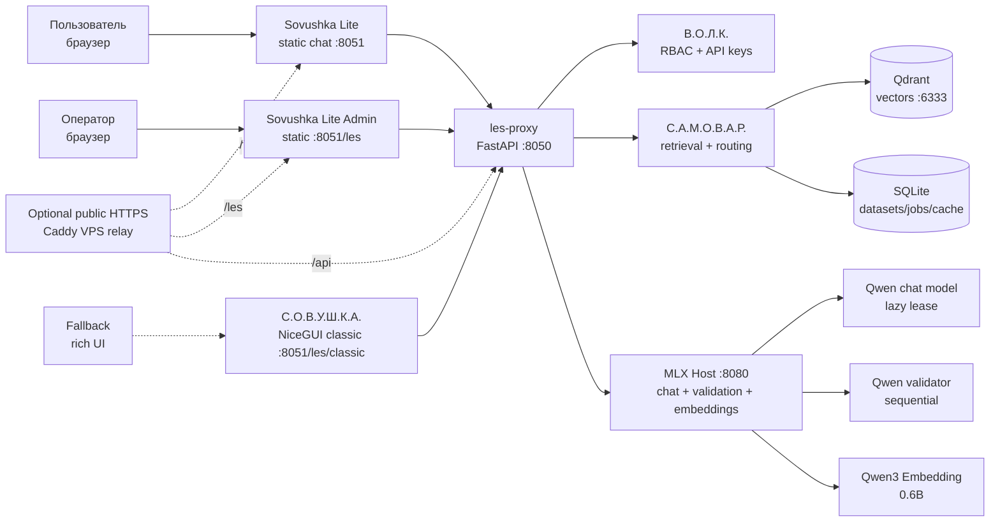
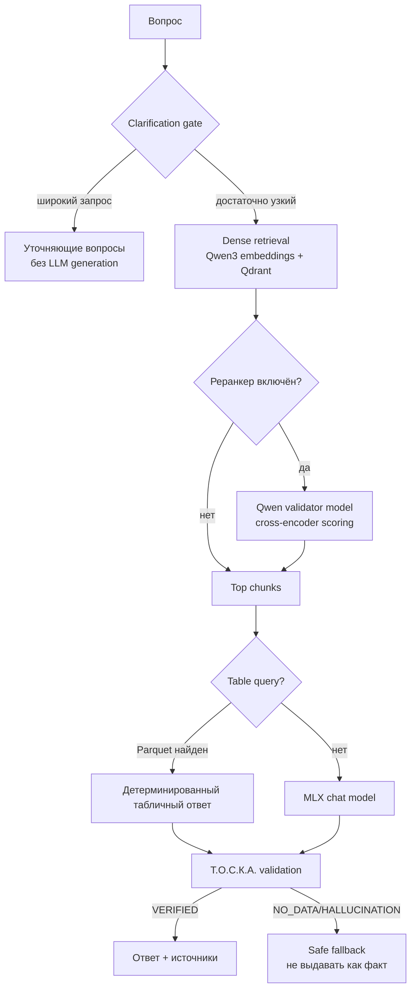
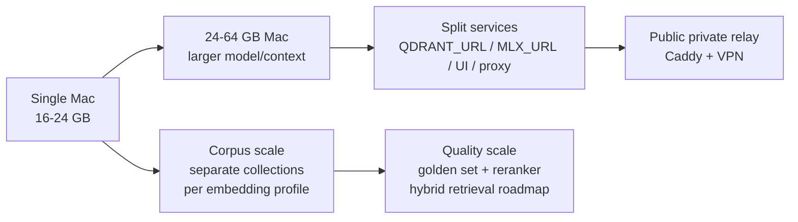

# Л.Е.С. — локальная RAG-машина для Apple Silicon

**Л.Е.С.** превращает приватный архив PDF, DOCX, таблиц и переписки в локальную базу знаний с ответами по источникам. Это self-hosted RAG appliance для Mac на Apple Silicon: Qdrant, MLX-модели, proxy, UI и метаданные работают на вашей машине или в вашей private network, без обязательного облака.

**Публичное позиционирование:** локальная RAG-машина для инженерных, нормативных и корпоративных архивов на Apple Silicon. Фокус: приватность, воспроизводимость, наблюдаемость, безопасная индексация и ответы с проверяемыми источниками.

**Актуальный статус: 26.05.2026.** Референсный контур работает на Mac Mini M4 / 24 GB в no-Docker runtime: Qdrant local binary, MLX Host, FastAPI proxy и Sovushka Lite chat/admin запускаются через launchd; rich NiceGUI UI сохранён как fallback. Активный embedding-профиль — `Qwen/Qwen3-Embedding-0.6B` в коллекции `les_rag_qwen3_06b`; legacy BGE-M3 сохранён отдельно. Текущий публичный baseline: `801/802` файлов проиндексировано, `264307` чанков, Qdrant points совпадают с SQLite; один тяжёлый book-PDF оставлен за ручным admission guard.

---

## Что это даёт

| Задача | Как выглядит для пользователя | Что делает система |
|---|---|---|
| Найти норму | «Минимальная ширина пути эвакуации по СП 1.13130?» | Ищет релевантные chunks, собирает ответ, показывает источники |
| Проверить ответ | Ответ помечается `VERIFIED`, `NO_DATA` или блокируется как неподтверждённый | Т.О.С.К.А. валидирует ответ отдельной локальной моделью |
| Загрузить архив | PDF/DOCX/XLSX/CSV/EML/MSG/JSON/MD/TXT | Smart intake классифицирует файлы, выбирает pipeline и индекс |
| Работать с таблицами | «Сумма по разделу X», «сколько позиций…» | XLSX/CSV превращаются в row-level chunks и Parquet artifacts |
| Эксплуатировать локально | Запуск одной командой, UI для диагностики, health/status API | launchd-сервисы, memory profiles, jobs, smoke tests |

Пример ответа:

```text
Вопрос: "Минимальная ширина пути эвакуации по СП 1.13130?"
Ответ:  "Не менее 1,2 м (п. 4.3.4 СП 1.13130.2022). [VERIFIED]"
Источник: СП 1.13130.2022.pdf, стр. 12
```

---

## Иллюстрация Контура





---

## Функции

| Блок | Возможности |
|---|---|
| RAG-чат | Ответы на русском языке с источниками, dataset filter, clarification gate, history drawer |
| SafeRAG | Post-generation validator, статусы `VERIFIED / NO_DATA / HALLUCINATION`, safe fallback |
| Индексация | Smart plan/sync/upload, Folder Watcher status/scan, deterministic routing, batch scheduler, guarded micro-indexing |
| Документы | PDF, DOCX, DOC, XLSX, XLS, CSV, EML, MSG, JSON, JSONL, MD, TXT |
| Таблицы | Row-level chunks, Parquet artifacts, прямые суммы/количества без LLM |
| UI | Lite-чат и Lite Admin без NiceGUI client state, classic NiceGUI fallback, метрики, jobs, runtime controls |
| Диагностика | `/api/health`, `/api/status`, `/api/metrics`, `/api/diag`, smoke/browser/golden tests |
| Внешний доступ | Опциональный HTTPS relay через Caddy + private VPN/ZeroTier; RAG и модели остаются на Mac |

---

## Безопасность

| Риск | Защита в Л.Е.С. |
|---|---|
| Утечка документов в облако | Штатный runtime полностью локальный; внешняя публикация — только relay до локального хоста |
| Публичный доступ к админке | Server-side RBAC, роли `admin/user`, API keys, trusted network только opt-in |
| Подмена trusted headers | `TRUSTED_PROXY_NETWORKS` ограничивает, от кого принимаются forwarded/trusted headers |
| Path traversal и удаление чужих файлов | Storage helpers проверяют dataset paths и границы storage root |
| Неподтверждённые ответы | SafeRAG не отдаёт validator timeout/error как нормальный факт |
| Отравление кэша | Semantic cache сохраняет только `VERIFIED` ответы и инвалидируется по dataset scope |
| Агрессивное завершение процессов | Memory preflight только предлагает кандидатов; чужие процессы получают SIGTERM только после явного выбора оператора |

---

## Стабильность

| Механизм | Что решает |
|---|---|
| No-Docker host runtime | Убирает Docker VM overhead на 16-24 GB Mac; Qdrant/proxy/MLX/UI живут как launchd jobs |
| Runtime profiles | `CHAT`, `CHAT_VALIDATED`, `INDEX_LIGHT`, `INDEX_HEAVY_PDF`, `MAINTENANCE` разделяют режимы нагрузки |
| Memory states | `GREEN/YELLOW/RED/CRITICAL` централизуют admission для chat/index/warmup |
| Model leases | Модели грузятся лениво; validator и embedder не должны конфликтовать с chat/index без admission |
| Heavy PDF guard | Тяжёлые book-PDF не идут в auto-index loop; нужен ручной `INDEX_HEAVY_PDF` или streaming pipeline |
| Lightweight chat/admin shell | `/` и `/les` отдают статические Lite-страницы без NiceGUI client state; `/classic` и `/les/classic` сохраняют rich fallback |
| Lightweight UI health | Sovushka отвечает `/healthz`; runtime status не рендерит тяжёлую NiceGUI страницу |
| Durable jobs | `/api/jobs` объединяет SQLite job history и live jobs |
| Regression suite | На 26.05.2026: `267 passed`, включая auth, storage, runtime admission, SafeRAG, Lite UI и indexer guards |

Подробная модель памяти описана в [RUNTIME_MEMORY_PROFILES.md](RUNTIME_MEMORY_PROFILES.md).

---

## Стек

| Слой | Технологии |
|---|---|
| Host | macOS + Apple Silicon, launchd, `uv`, Python 3.12 |
| LLM runtime | MLX / `mlx-lm`, OpenAI-compatible local host on `:8080` |
| Chat model | Safe 24 GB default: `mlx-community/Qwen3.5-4B-OptiQ-4bit`; quality profile: `mlx-community/Qwen3-14B-4bit` |
| Validator/reranker | `mlx-community/Qwen3-4B-Instruct-2507-4bit` или compatible `Qwen3-4B` profile |
| Embeddings | Active: `Qwen/Qwen3-Embedding-0.6B`; legacy baseline: `BAAI/bge-m3` |
| Vector DB | Qdrant local binary + per-profile collections |
| Backend | FastAPI, httpx, SQLite, LlamaIndex-compatible backend interfaces |
| Frontend | Sovushka Lite static chat/admin + optional NiceGUI classic / С.О.В.У.Ш.К.А. |
| Storage | Local filesystem + SQLite metadata, Parquet artifacts for tables |
| Public relay | Optional Caddy + Let's Encrypt + ZeroTier/private network |

Model references: [Qwen3 Embedding 0.6B](https://huggingface.co/Qwen/Qwen3-Embedding-0.6B), [Qwen3.5-4B OptiQ MLX](https://huggingface.co/mlx-community/Qwen3.5-4B-OptiQ-4bit), [Qwen3-4B Instruct 2507 MLX](https://huggingface.co/mlx-community/Qwen3-4B-Instruct-2507-4bit), [Qwen MLX docs](https://qwen.readthedocs.io/en/latest/run_locally/mlx-lm.html).

---

## Масштабируемость



| Направление | Как масштабировать |
|---|---|
| RAM/модели | 16 GB — малые модели; 24 GB — стабильный локальный RAG; 32-64 GB — больше контекст и 14B+ профили |
| Корпус | Раздельные Qdrant collections на embedding profile; SQLite metadata; batch scheduler |
| Индексация | `batch_limit=1`, post-batch memory guard, heavy PDFs только через manual admission |
| Пользователи | Public UI можно вынести за VPS relay; RAG/LLM остаются на локальном Mac |
| Качество | Golden set, retrieval-debug, optional reranker, будущий hybrid dense+sparse/RRF |
| Сервисы | `MLX_URL`, `QDRANT_URL`, `PROXY_URL` позволяют разнести компоненты без смены UX |

---

## Рекомендуемые Модели

| Машина | Chat model | Validator / reranker | Embeddings | Комментарий |
|---|---|---|---|---|
| Apple Silicon 16 GB | `mlx-community/Qwen3.5-4B-OptiQ-4bit` | выключить по умолчанию или запускать строго последовательно | `Qwen/Qwen3-Embedding-0.6B` | Лёгкий RAG, небольшие контексты, без параллельной индексации |
| Apple Silicon 24 GB | `mlx-community/Qwen3.5-4B-OptiQ-4bit` | `mlx-community/Qwen3-4B-Instruct-2507-4bit` | `Qwen/Qwen3-Embedding-0.6B` | Текущий безопасный default: UI + chat + retrieval с запасом памяти |
| Apple Silicon 24 GB, quality run | `mlx-community/Qwen3-14B-4bit` | только sequential validation | `Qwen/Qwen3-Embedding-0.6B` | Лучше для сложной аналитики, но не совмещать с heavy indexing |
| Apple Silicon 32-64 GB | `Qwen3-14B` и более крупные MLX/GGUF профили после golden-set проверки | Qwen3 reranker/validator 4B или 8B | Qwen3 Embedding 0.6B/4B | Имеет смысл, если вырос corpus или нужен длинный контекст |

Правило эксплуатации: на 24 GB не держать одновременно chat model, validator, embedder и тяжёлый PDF parser. Сначала профиль, потом admission, затем job.

---

## Модули Системы

| Аббревиатура | Расшифровка | Роль |
|---|---|---|
| **Л.Е.С.** | Локальная Единая Система | Оркестратор, API Gateway |
| **Ж.А.Б.А.** | Жёсткая Аппаратная База Аналитики | Apple Silicon host |
| **С.А.М.О.В.А.Р.** | Система Автономной Машинной Обработки Внутренних Архивов RAG | RAG / Qdrant |
| **Т.О.С.К.А.** | Терминал Оценки, Самопроверки и Контроля Архитектуры | SafeRAG validator |
| **С.О.В.У.Ш.К.А.** | Система Обработки и Выдачи: Умная, Шаблонизированная, Классифицированная, Автоматизированная | NiceGUI UI |
| **П.Р.О.Р.А.Б.** | Программа Регулярной Оценки Работы Автономной Базы | Метрики / диагностика |
| **Д.И.А.Г.Н.О.З.** | Диспетчер Инфраструктурного Анализа Готовности, Нагрузки, Ошибок и Здоровья | Живая диагностика |
| **К.О.Т.** | Куратор Отраслевой Терминологии | Семантический фильтр |
| **В.О.Л.К.** | Внутренний Охранный Локальный Контур | Auth / RBAC |
| **П.А.У.К.** | Периметровый Автономный Узел Коммуникаций | Optional VPS relay |
| **С.У.Х.А.Р.И.К.** | Система Управления Холодными Архивами и Резервными Источниками Комплекса | Snapshots / backup |

---

## Быстрый старт

### Требования
- Mac с Apple Silicon (M1/M2/M3/M4) и минимум 16 GB RAM; комфортный профиль — 24 GB+
- Локальный Qdrant binary `/Users/ovc/.local/bin/qdrant`; Docker не требуется
- [uv](https://docs.astral.sh/uv/) (`brew install uv`)
- Python 3.12+

### Установка

```bash
git clone https://github.com/proovcme/les_rag.git
cd les_rag

# Зависимости
uv sync

# Конфигурация
cp env.example .env
# Отредактируй .env — укажи пароль, trusted networks и модельный профиль

# Запуск host-runtime через launchd:
# memory preflight + Qdrant + MLX + proxy + UI + guarded indexer
./start_les.command
```

Открой `http://localhost:8051` для Lite-чата, `http://localhost:8051/les` для Lite Admin, `http://localhost:8051/classic` для прежнего NiceGUI-чата или `http://localhost:8051/les/classic` для rich-админки.

На рабочем столе есть аварийный ярлык `Запуск_ЛЕС.command`: он вызывает `start_les.command`,
поднимает launchd-сервисы и открывает С.О.В.У.Ш.К.А. Управлять контуром можно и из админки:
`/les → П.Р.О.Р.А.Б. → АВАРИЙНОЕ УПРАВЛЕНИЕ`.

### Добавление документов

```bash
# Положи PDF/DOCX в папку
mkdir -p RAG_Content/MyDocs
cp my_norms/*.pdf RAG_Content/MyDocs/

# Сухой smart-plan: покажет accepted/rejected и будущие индексы
curl -s http://localhost:8050/api/rag/smart-plan | python3 -m json.tool

# Smart sync: файлы раскладываются по классифицированным индексам
curl -X POST http://localhost:8050/api/rag/sync-smart \
  -H 'Content-Type: application/json' \
  -d '{"source_root":"RAG_Content","parse":false}'

# Folder Watcher: показать новые/изменённые/route_changed файлы без запуска parse
curl -s 'http://localhost:8050/api/rag/watch/status?source_root=RAG_Content' \
  | python3 -m json.tool

# Зарегистрировать только new/changed файлы; route_changed выводится отдельно в reindex-plan
curl -X POST http://localhost:8050/api/rag/watch/scan \
  -H 'Content-Type: application/json' \
  -d '{"source_root":"RAG_Content","limit":20}'

# План selective reindex для документов, которые новые правила routing отправляют в другой dataset
curl -s 'http://localhost:8050/api/rag/watch/reindex-plan?source_root=RAG_Content' \
  | python3 -m json.tool

# Smart upload одного файла: индекс выбирается автоматически
curl -X POST http://localhost:8050/api/rag/upload-smart \
  -F "file=@my_smeta.csv"
```

---

## RAG Pipeline

```
Запрос пользователя
      │
      ▼
Clarification gate
      ├── широкий/неясный запрос → NEEDS_CLARIFICATION + вопросы
      └── узкий запрос → retrieval
      │
      ▼
Векторный поиск (Qwen3-Embedding-0.6B + Qdrant; BGE-M3 legacy)  top-8 чанков
      │
      ▼ [опционально, включается в UI]
Реранкер (Qwen3-4B batch) → top-5 релевантных чанков
      │
      ▼
Table query gate
      ├── найден parquet_path + табличный вопрос → точный VERIFIED ответ из Parquet
      └── нет табличного ответа → LLM
      │
      ▼
Промпт = системный + контекст + вопрос
      │
      ▼
Qwen3.5-4B OptiQ или Qwen3-14B (MLX, Metal)
      │  ответ
      ▼
Т.О.С.К.А. валидация (Qwen3-4B, sequential lease)
      │  VERIFIED / NO_DATA / HALLUCINATION
      ▼
Ответ пользователю + источники
```

---

## Форматы вывода

С.О.В.У.Ш.К.А. умеет форматировать ответ в:
- Свободный текст
- Спецификацию оборудования (по ГОСТ 21.110)
- JSON-дерево / иерархическую схему
- Mermaid-диаграмму (flowchart, sequence, ER)
- SVG-схему
- Произвольную таблицу
- Артефакт в правой панели чата с копированием JSON/SVG/Mermaid

Расширенные параметры запроса вынесены из основной области в модальное окно **Расширенный запрос**: формат, датасет, стиль, реранкер и шаблон вывода. История чатов открывается выезжающей левой панелью.

---

## Внешний доступ (П.А.У.К.)

Система может публиковаться через HTTPS без открытия портов домашней сети:

```
Интернет → <your-domain> (VPS, Caddy, SSL)
                │
          HTTPS relay на VPS
                │
          private VPN/LAN или SSH tunnel
                │
         app host :8050/:8051
```

Доступ по ключам (В.О.Л.К.):
- `admin` — полный интерфейс
- `user`  — только AI ЧАТ
- Loopback (`127.0.0.1`, `::1`) — trusted admin без ключа по умолчанию
- VPN/LAN CIDR — trusted admin только если оператор явно добавил сеть в `TRUSTED_NETWORKS`
- Внешний доступ через `<your-domain>` — ключ обязателен по умолчанию

Reverse proxy может помечать запросы из выбранного private CIDR заголовком
`X-LES-Trusted-Network: 1`; UI/API доверяют этому заголовку только от адресов из
`TRUSTED_PROXY_NETWORKS`. Для публичного клона безопасный дефолт — не доверять
никакой внешней сети автоматически: добавляй VPN/LAN CIDR только в приватном `.env`.

Публичные маршруты UI:
- `https://<your-domain>/` — Lite-чатовый контур, не монтирует NiceGUI client state.
- `https://<your-domain>/les` — Lite Admin: индекс, память, jobs, runtime controls без NiceGUI client state.
- `https://<your-domain>/classic` — прежний rich NiceGUI chat для локальной работы.
- `https://<your-domain>/les/classic` — rich NiceGUI admin fallback, доступен только admin/trusted.

---

## Управление памятью

Система рассчитана на реальные ограничения unified memory Apple Silicon: macOS, GPU/Metal, UI, Qdrant, proxy, embedding и LLM делят один общий бюджет. Поэтому LES использует admission profiles, lazy model leases и guarded indexing.

| Компонент | Типичный режим |
|---|---|
| Qdrant local binary | ~1.5-2.0 GB RSS на текущем индексе |
| Sovushka UI | ~90 MB cold start, ~500 MB после Lite Admin refresh; `/classic` и `/les/classic` могут поднять RSS из-за NiceGUI client state |
| les-proxy | сотни MB, без Docker VM |
| MLX Host idle | сотни MB; модели не resident до запроса |
| Chat model | lazy load на время ответа; размер зависит от модели и квантования |
| Validator | sequential lease после ответа; не держать параллельно с heavy indexing |
| Embedder | lazy lease для retrieval/index batch |

В штатном режиме Docker/OrbStack отсутствуют. Qdrant, proxy, MLX и UI запускаются на host через launchd; `docker-compose.yml` и `Dockerfile.proxy` оставлены как legacy-артефакты репозитория, не как runtime.

`start_les.command` использует `tools/les_runtime_control.py`: сначала делает memory preflight, показывает крупнейшие RSS-процессы, затем поднимает Qdrant, MLX, `les-proxy`, guarded Qwen indexer и С.О.В.У.Ш.К.А. как host LaunchAgents. Если запуск интерактивный, оператор может явно выбрать чужие процессы для `SIGTERM`; автоматически LES не убивает процессы вне своего контура.

`mlx_host.py` читает `.env` самостоятельно при старте — не зависит от оболочки запуска.

Профили runtime:

| Профиль | Назначение |
|---|---|
| `CHAT` | основной рабочий чат; индексация и validator concurrency запрещены без admission |
| `CHAT_VALIDATED` | чат + последовательная Т.О.С.К.А. валидация |
| `INDEX_LIGHT` | обычные документы, batch=1, post-batch memory guard |
| `INDEX_HEAVY_PDF` | только ручной режим; UI/chat/validator выключаются |
| `MAINTENANCE` | диагностика, lexical index, миграции, snapshots |

### Performance flags

```bash
# Кэширует только VERIFIED ответы. Переиндексация датасета инвалидирует scope через chunk_count.
SEMANTIC_CACHE_ENABLED=true
SEMANTIC_CACHE_THRESHOLD=0.94

# Экспериментальный PDF tables → Parquet слой. Markdown ingestion PDF остаётся основным fallback.
PDF_TABLE_EXTRACTION_ENABLED=false
PDF_TABLE_MAX_PAGES=30
PDF_TABLE_MAX_TABLES=50
DOC_ROUTER_SAMPLE_PAGES=3
```

### Новое в релизе 22.05.2026

- Чат Совушки отделён от админки: меньше фоновых UI-зависимостей на основном рабочем экране.
- `reconnect_timeout=180` и `chat_pending` помогают переживать долгие RAG-запросы и реконнекты.
- Premium chat layout: нижний composer, левая drawer-история, правая панель артефактов.
- `restart_sovushka.command` запускает UI через `.venv/bin/python3`, чтобы не сваливаться в системный Python 3.9.
- Добавлены semantic cache, document router, Parquet/XLSX/CSV pipeline и тесты для них.

### Новое в релизе 23.05.2026

- **Smart intake:** `verify_source_file()` отбрасывает служебные директории, UUID staging, неподдержанные расширения, пустые и слишком крупные файлы (`RAG_SOURCE_MAX_MB`, default `100`).
- **Smart plan/sync:** `/api/rag/smart-plan` и `/api/rag/sync-smart` строят deterministic route по имени, пути, типу, размеру и probes без LLM.
- **Smart upload:** `/api/rag/upload-smart` сохраняет файл потоково, классифицирует через Document Router, сам выбирает/создаёт `*_Index` и запускает guarded parse `limit=1`.
- **Clarification gate:** `/api/chat` возвращает `NEEDS_CLARIFICATION` и уточняющие вопросы до retrieval/LLM, если запрос слишком широкий.
- **Table query MVP:** `proxy/services/table_query_service.py` читает `.parquet` по `parquet_path` из payload и считает суммы/количества без генерации LLM.
- **No-Docker runtime:** Qdrant local binary, `les-proxy`, MLX Host и UI работают на host LaunchAgents; Docker Desktop/OrbStack не требуются.
- **Micro-indexing:** safe loop `tools/rag_safe_parse_loop.py` индексирует по одному файлу, проверяет RAM/swap и `points_match_sqlite_chunks`.
- **Memory guard fix:** `swap_pct=0.0` больше не превращается в `100.0` в safe-loop и server-side parse admission.
- **Startup hardening:** `les.command` стартует Qdrant, MLX, host-proxy и UI без дублирования уже живых listener-процессов.
- **Sovushka emergency control:** П.Р.О.Р.А.Б. получил локальные launchd-кнопки start/stop/restart для Qdrant, MLX, proxy, UI и guarded indexer; управление не зависит от работоспособности proxy.
- **Resource Governor v1:** `/api/indexing-mode` разделяет рабочий чат и индексацию, ставит chat generation на паузу, управляет unload MLX и приоритетом индексов.
- **Parse scheduler v2:** приоритет `NTD_FIRE → GKRF → NTD_ELECTRICAL → NTD_STRUCTURAL → TABLE_SMETA → NTD_OTHER`, post-batch memory hysteresis, `warm_embedder`, phase timings.
- **Е.Ж.И.К. v1:** `/api/mail/status`, `/api/mail/import-local` и `/api/mail/import-imap` регистрируют локальные `.eml/.msg` и новые IMAP-письма в `MAIL_Index`; IMAP credentials читаются только из `.env`, checkpoint UID хранится локально.
- **BGE/chunk knobs:** `BGE_BATCH_SIZE`, `RAG_EMBED_BATCH`, `RAG_CHUNK_SIZE`, `RAG_CHUNK_OVERLAP`, `RAG_PARSE_POST_MAX_SWAP_PCT`.
- **Состояние индекса на 26.05.2026:** `indexed_files=801`, `pending_files=1`, `chunks=264307`, Qdrant points `264307`, `points_match_sqlite_chunks=true`, `errors=0`.
- **Проверки на 26.05.2026:** `uv run pytest -q` → `267 passed`; `git diff --check` → OK.

### Новое в релизе 26.05.2026

- **Runtime memory profiles:** `/api/status` и `/api/indexing-mode` показывают активный `runtime_profile` и `memory_state`.
- **Startup memory preflight:** `start_les.command` перед стартом показывает крупнейшие процессы и предлагает ручной `SIGTERM` только безопасным кандидатам.
- **Heavy PDF guard:** автоиндексатор не запускает parse job, если pending очередь состоит только из тяжёлых book-PDF; runtime возвращается в `CHAT`.
- **Sovushka Lite:** `/` теперь статический чатовый shell без NiceGUI client state; прежний rich chat доступен на `/classic`.
- **Sovushka Lite Admin:** `/les` теперь статическая memory-first админка; прежняя rich NiceGUI admin доступна на `/les/classic`.
- **Runtime Dispatcher v0:** `/api/runtime/dispatcher/status` объединяет память, launchd-сервисы, guarded reindex и wait-only memory recommendations; chat admission учитывает активный reindex даже после рестарта proxy.
- **Е.Ж.И.К. IMAP v1:** `/api/mail/import-imap` забирает новые письма через IMAP, сохраняет raw `.eml` в `RAG_Content/MAIL/IMAP`, регистрирует их в `MAIL_Index` и уважает dispatcher/reindex guard.
- **Folder Watcher v0:** `/api/rag/watch/status` сравнивает smart-plan с SQLite metadata, `/api/rag/watch/scan` регистрирует только `new/changed` файлы без parse, а `/api/rag/watch/reindex-plan` строит dry-run план для `route_changed`.
- **Sovushka `/healthz`:** runtime health check больше не рендерит страницу `/les`, чтобы не создавать тяжёлый NiceGUI client state.
- **Launchd hardening:** `start_service` делает `launchctl enable` перед bootstrap/kickstart; disabled labels не ломают восстановление контура.

### Следующая сессия

Начать с независимой оценки архитектуры: пройти runtime/resource-governor/indexing/RAG-quality как внешний reviewer, не продолжая кодинг до формулировки рисков, границ и приоритетов.

---

## Быстрая диагностика

```bash
# Все сервисы
curl -s http://localhost:8050/api/diag | python3 -c \
  "import sys,json; [print(f\"{r['status'].upper():6} {r['name']}\") for r in json.load(sys.stdin)['checks']]"

# Метрики (файлы, чанки, RAM, CPU)
curl -s http://localhost:8050/api/metrics | python3 -m json.tool

# Логи в реальном времени
tail -f logs/proxy.log | grep -E "\[CHAT\]|\[PARSE\]|\[ERROR\]"
```

### Runtime smoke после деплоя

```bash
# Локальный контур: localhost считается trusted admin; VPN/LAN включается только через TRUSTED_NETWORKS
uv run python tools/runtime_smoke.py \
  --admin-key "$ADMIN_PASSWORD" \
  --question "Ширина путей эвакуации"

# VPS/public URL: без ключа admin endpoint обязан вернуть 401/403
LES_PROXY_URL=https://<your-domain> \
LES_UI_URL=https://<your-domain> \
LES_ADMIN_KEY="$ADMIN_PASSWORD" \
LES_USER_KEY="user-key" \
uv run python tools/runtime_smoke.py \
  --expect-external-auth \
  --question "Ширина путей эвакуации"
```

Smoke проверяет health/status/metrics/diag, загрузку UI shell, auth boundary для admin/user ключей и опциональные живые RAG-вопросы.

### RAG golden set после milestone индексирования

```bash
uv run python tools/rag_golden_set.py \
  --key-db data/les_meta.db \
  --key-role user
```

Golden set использует `/api/rag/retrieve-debug`, поэтому проверяет качество найденных источников без запуска LLM. Базовые NTD-кейсы лежат в `golden/ntd_golden_set.json`; после каждого блока micro-indexing команда должна проходить без падений и показывать ожидаемые source/content hints.

### Indexing mode

```bash
# Включить режим индексации: выгружает MLX-модели, ставит chat generation на паузу
curl -X POST http://localhost:8050/api/indexing-mode \
  -H 'Content-Type: application/json' \
  -d '{"enabled":true,"reason":"night batch","unload_models":true}'

# Один приоритетный batch: NTD_FIRE → GKRF → NTD_ELECTRICAL → NTD_STRUCTURAL → TABLE_SMETA → NTD_OTHER
curl -X POST http://localhost:8050/api/rag/parse-scheduler \
  -H 'Content-Type: application/json' \
  -d '{"batch_limit":1,"max_batches":1,"background":false,"stop_on_error":true}'

# Короткая warm-embedder серия: не выгружать embedder между файлами, но остановиться после batch при росте swap
curl -X POST http://localhost:8050/api/rag/parse-scheduler \
  -H 'Content-Type: application/json' \
  -d '{"batch_limit":1,"max_batches":3,"warm_embedder":true,"post_batch_max_swap_pct":60,"background":false,"stop_on_error":true}'

# Qwen до полного pending=0: launchd runner не стартует второй scheduler,
# пока активна текущая волна; каждая волна batch_limit=1, max_batches=1000.
cp qwen_index_launchd.plist ~/Library/LaunchAgents/me.ovc.les.qwen-index-until-done.plist
launchctl bootstrap gui/$(id -u) ~/Library/LaunchAgents/me.ovc.les.qwen-index-until-done.plist
tail -f logs/qwen_index_until_done.log

# Вернуться к рабочему чату
curl -X POST http://localhost:8050/api/indexing-mode \
  -H 'Content-Type: application/json' \
  -d '{"enabled":false,"reason":"work/chat"}'
```

В `indexing-mode` чат-генерация возвращает `409`, чтобы не грузить main LLM параллельно с embedder. Clarification/retrieval/golden запускаются только после явного возврата в chat mode.

Ответ `parse-scheduler` содержит phase timings по batch: `convert_sec`, `chunk_sec`, `embed_sec`, `upsert_sec`, `count_sec`. Это основной диагностический сигнал для ускорения индексации; на контрольном NTD_FIRE-файле bottleneck был в `embed_sec`.

Операторские env-ручки:

```env
LES_EMBED_PROFILE=legacy       # legacy|quality|qwen|fast; legacy keeps historical les_rag
EMBEDDING_MODEL=BAAI/bge-m3    # or Qwen/Qwen3-Embedding-0.6B for qwen profile
EMBED_MODEL=bge-m3             # API model name sent to /v1/embeddings
RAG_COLLECTION_NAME=les_rag    # do not mix embedding models in one collection
RAG_META_DB_PATH=./data/les_meta.db
RAG_VECTOR_SIZE=1024
BGE_BATCH_SIZE=16              # внутренний batch sentence-transformers; меньше = ниже peak memory
RAG_EMBED_BATCH=16             # чанков за один HTTP-запрос к /v1/embeddings
RAG_CHUNK_SIZE=900             # больше chunk = меньше embedding-вызовов
RAG_CHUNK_OVERLAP=80
RAG_PARSE_POST_MAX_SWAP_PCT=60 # auto-stop после batch
MAIL_IMAP_HOST=imap.example.com
MAIL_IMAP_PORT=993
MAIL_IMAP_SSL=true
MAIL_IMAP_LOGIN=mail@example.com
MAIL_IMAP_PASSWORD=app-password
MAIL_IMAP_FOLDERS=INBOX
MAIL_IMAP_CHECKPOINT_DIR=data/mail_imap_checkpoints
MAIL_IMAP_STORAGE_ROOT=RAG_Content/MAIL/IMAP
```

Qwen-native индексирование идёт в отдельную коллекцию, чтобы не смешивать векторы разных embedding-моделей:
`LES_EMBED_PROFILE=qwen`, `EMBEDDING_MODEL=Qwen/Qwen3-Embedding-0.6B`,
`RAG_COLLECTION_NAME=les_rag_qwen3_06b`, `RAG_META_DB_PATH=./data/les_meta_qwen.db`,
`RAG_VECTOR_SIZE=1024`.

Ожидаемая плотность Qwen-чанков ниже BGE: профиль Qwen использует `RAG_CHUNK_SIZE=1400`
и `RAG_CHUNK_OVERLAP=100`, тогда как legacy BGE использовал `900/80`. На первых 18 общих
файлах Qwen дал `2045` chunks против `3306` у BGE (`ratio=0.619`), что соответствует
настройкам и не означает потери документов.

### Browser smoke UI

```bash
# Локально: trusted localhost должен сразу открыть admin shell
uv run --with playwright python tools/browser_smoke.py --trusted-local

# VPS/public URL: проверка логина admin/user и границ видимости вкладок
LES_UI_URL=https://<your-domain> \
LES_ADMIN_KEY="$ADMIN_PASSWORD" \
LES_USER_KEY="user-key" \
uv run --with playwright python tools/browser_smoke.py \
  --question "Ширина путей эвакуации"
```

При первом запуске на машине может понадобиться браузер Playwright:

```bash
uv run --with playwright python -m playwright install chromium
```

Browser smoke проверяет admin-вкладки, user-вкладки, отсутствие admin-разделов у user и, если передан вопрос, появление ответа в UI-чате.

---

## Структура репозитория (публичная версия)

```
les_rag/
├── README.md
├── pyproject.toml
├── .env.example
├── qdrant_launchd.plist
├── qwen_index_launchd.plist
├── docker-compose.yml        ← legacy/archived Docker fallback
├── Dockerfile.proxy          ← legacy Docker proxy image
├── proxy/                    ← Proxy v3: app, security, services, storage
│   ├── app.py                ← create_app(), startup, middleware, router wiring
│   ├── legacy_app.py         ← compatibility shim for old imports
│   ├── routers/              ← auth, chat, datasets, runtime, diagnostics, jobs
│   ├── security.py           ← X-API-Key/Bearer, admin/user guards
│   └── services/             ← JobService, retrieval, SafeRAG, clarification, table query
├── start_mlx.command
├── stop_mlx.command
├── start_pauk.command        ← резервный SSH tunnel к VPS
├── stop_pauk.command
├── pauk_launchd.plist        ← launchd автозапуск туннеля (Mac Mini)
├── mlx_host.py               ← MLX Native Host
├── backend/
│   ├── mlx_adapter.py        ← MLXMemoryManager
│   ├── qdrant_adapter.py     ← EmbedClient + RAG
│   ├── smart_index.py        ← source verification + smart plan
│   ├── document_router.py    ← deterministic ingestion classifier
│   ├── parquet_writer.py     ← table normalization + parquet artifacts
│   ├── converter.py          ← PDF/DOCX/XLSX → текст
│   ├── metrics_collector.py
│   └── interface.py
├── tools/
│   ├── runtime_smoke.py      ← post-deploy smoke: auth/UI/runtime/RAG
│   └── browser_smoke.py      ← Playwright smoke: UI admin/user scenarios
├── sovushka/                 ← UI модули (рефакторинг)
│   ├── config.py             ← PROXY_URL, MLX_URL, UI_PORT
│   ├── state.py
│   ├── styles.py
│   └── pages/
│       ├── chat.py
│       ├── samovar.py
│       └── ...
└── sovushka_ng.py            ← точка входа UI
```

**Не входит в публичную версию:** `.env`, ключи, данные индексов.

---

## Лицензия

MIT — используй, форкай, улучшай.  
Если делаешь что-то интересное на этой базе — открой issue, интересно посмотреть.

---

## Дорожная карта

- [x] RAG pipeline (Qdrant + BGE-M3 + Qwen3)
- [x] CRAG валидация (Т.О.С.К.А.) — VERIFIED / NO_DATA / HALLUCINATION
- [x] NiceGUI интерфейс (С.О.В.У.Ш.К.А.) v5.0 — модульная архитектура
- [x] Светлая и тёмная тема — персистентная через `app.storage.user`, WCAG AA контрасты
- [x] Внешний доступ через VPS (П.А.У.К.) — Caddy + Let's Encrypt + ZeroTier, `<your-domain>` live
- [x] Auth по ключам (В.О.Л.К.) — admin/user роли, временные ключи, привязка к устройству (fingerprint)
- [x] Proxy v3 — тонкий `proxy_server.py`, пакет `proxy/`, server-side guards для admin/user endpoints
- [x] Stabilization tests — pytest regression для trusted network и API-key RBAC boundary
- [x] История чатов (SQLite `chat_history`) — выживает рестарт процесса
- [x] SafeRAG error handling — таймаут/ошибка валидатора → safe fallback, неподтверждённый ответ не отдаётся как нормальный
- [x] Rate limiting (≤ 2 параллельных LLM-запроса), защита от prompt injection, path traversal
- [x] `les.command` — единый скрипт управления (start/stop/restart/status)
- [x] Startup hardening — host LaunchAgents для Qdrant/proxy/MLX/UI без Docker daemon
- [x] Proxy modularization — активные endpoints вынесены в routers/services, `legacy_app.py` оставлен shim
- [x] Stabilization: runtime smoke для локального/VPS post-deploy контура
- [x] Stabilization: browser smoke UI admin/user сценариев
- [ ] RAG quality hardening: hybrid retrieval (dense + exact/sparse), расширение golden set, trace/audit
- [x] RAG intake hardening: smart-plan, source verification, size guard, excluded dirs
- [x] Chat clarification gate — broad запросы получают уточняющие вопросы до retrieval/LLM
- [x] Performance: semantic cache для VERIFIED ответов с dataset-scope invalidation
- [ ] Performance backlog: streaming validation, embedder TTL/offload, MLX tuning
- [x] Indexing mode + parse scheduler — приоритетные батчи pending файлов с memory hysteresis
- [x] Folder Watcher v0 — status/scan новых и изменённых файлов + dry-run план route_changed
- [ ] Folder Watcher v1 — фоновое расписание scans через dispatcher/admission
- [x] Parquet pipeline для XLSX/XLS/CSV — row-level chunks + `.parquet` artifacts
- [x] Experimental PDF tables → Parquet — PyMuPDF first, pdfplumber fallback, `needs_ocr` marker
- [x] Table query MVP — суммы/количества из Parquet по `parquet_path` без LLM
- [x] Document Router — быстрый probe/classify/complexity перед выбором ingestion pipeline
- [ ] XLS/CSV export — выдача табличных результатов как готовых файлов
- [ ] Field Intake — внешние формы загрузки в карантинный `FIELD_Index`
- [x] Е.Ж.И.К. v0 — локальный импорт EML/MSG в `MAIL_Index`
- [x] Е.Ж.И.К. v1 — IMAP коннектор для почты
- [ ] VLM pipeline — анализ PDF-чертежей

### Backlog ускорения и оптимизации

- **Семантическое кэширование:** базовый слой внедрён для `VERIFIED` ответов. Ключ учитывает semantic similarity и snapshot датасетов (`chunk_count`), чтобы переиндексация инвалидировала старые ответы.
- **Динамическая выгрузка эмбеддера:** держать `bge-m3` в памяти только во время retrieval/warm path, затем выгружать по агрессивному TTL, освобождая RAM/MPS для основной LLM.
- **Параллельная валидация:** перейти от post-factum проверки полного ответа к асинхронной проверке чанков по мере streaming generation, чтобы снизить time-to-first-token в UI.
- **Аппаратный тюнинг MLX:** проверить Flash Attention на длинном контексте и смешанное квантование 14B модели: критичные слои в 8 bit, остальные в 4 bit.
- **Embed pipeline tuning:** после завершения qwen-индексации отдельно разобрать `embed_sec` как главный bottleneck. Идеи для проработки: увеличить `RAG_EMBED_BATCH` при стабильной RAM/MPS, проверить adaptive chunking для тяжёлых СП/ГОСТ, сравнить скорость/качество Qwen embeddings и BGE-M3 на golden set, ввести режим быстрой первичной индексации и последующей качественной переиндексации.
- **Adaptive chunking + GUI profiles:** вынести в админку профили чанкинга (`default`, `normative`, `table`, `pdf_ocr`, `email`) с настройками `chunk_size`, `chunk_overlap`, min/max chunk size, склейкой коротких пунктов, запретом разрыва нумерованных пунктов и таблиц. Добавить preview chunking по выбранному файлу и явную кнопку reindex affected documents; изменение настроек должно помечать документы как требующие переиндексации, а не смешивать старые и новые чанки молча.
- **Табличный контур:** базовый Parquet ingestion внедрён для XLSX/XLS/CSV. PDF tables слой добавлен как экспериментальный `PDF_TABLE_EXTRACTION_ENABLED`: PyMuPDF `find_tables()` first, pdfplumber fallback, сканы помечаются `needs_ocr`. Первый query слой уже читает parquet напрямую для сумм/количеств; следующий шаг — фильтры, группировки, сравнение смет и UI-таблица `table_query.rows`.
- **Полевой загрузчик:** внешняя форма через П.А.У.К. для загрузки актов, фотоотчётов, предписаний и комментариев в изолированный карантинный датасет `FIELD_Index`, без смешивания с нормативной базой.
- **Выдача XLS/CSV:** экспорт табличных ответов и AG Grid результатов в цифровой артефакт для смет, ведомостей и рабочей документации.
