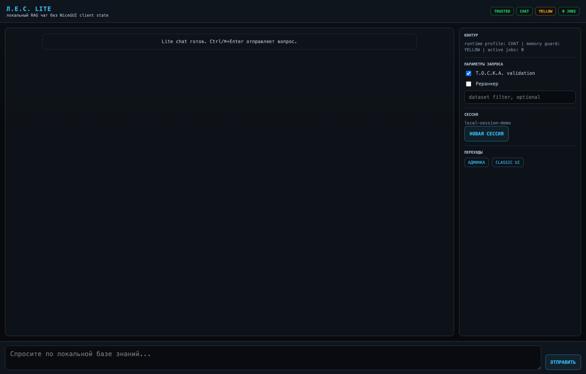
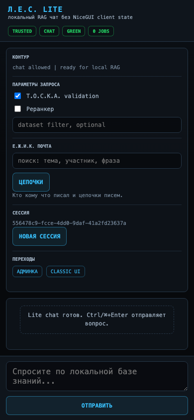
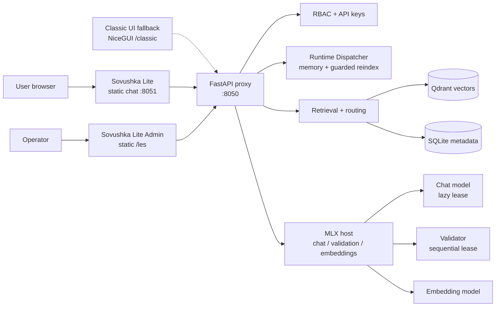
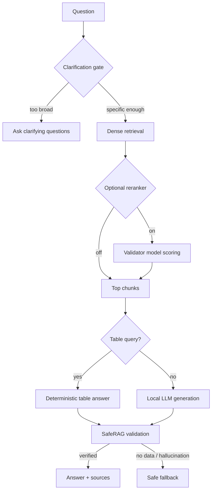
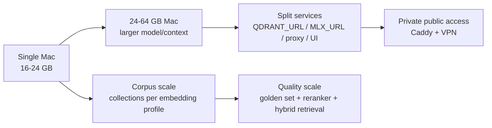

# Л.Е.С. — локальная RAG-машина для Apple Silicon

**Л.Е.С.** превращает приватный архив PDF, DOCX, таблиц, Markdown, JSON,
локальной почты и IMAP-писем в локальную базу знаний с ответами по источникам.
Система рассчитана на Mac с Apple Silicon и unified memory: Qdrant, MLX,
FastAPI proxy, UI и метаданные работают на вашей машине или внутри private
network.

Позиционирование проекта: **локальный RAG appliance для инженерных, нормативных
и корпоративных архивов на Apple Silicon**. Главные акценты: приватность,
воспроизводимость, наблюдаемость, безопасная индексация, memory guardrails и
проверяемые ответы.

> Public repo содержит безопасный snapshot кода и документации. Приватные
> датасеты, `.env`, индексы, логи, ключи и локальные runtime artifacts сюда не
> входят.

## Скриншоты

<p>
  
</p>

<p>
  
</p>

## Что Это Даёт

| Задача | Для пользователя | Что делает Л.Е.С. |
|---|---|---|
| Найти норму или факт | Задать вопрос по локальному архиву | Ищет релевантные chunks, собирает ответ, показывает источники |
| Проверить ответ | Видеть `VERIFIED`, `NO_DATA` или safe fallback | Отдельный validator снижает риск неподтверждённых ответов |
| Загрузить архив | Положить файлы в `RAG_Content/` или загрузить через API/UI | Smart intake классифицирует файлы и выбирает pipeline |
| Работать с таблицами | Спрашивать суммы, количества, позиции | XLSX/CSV превращаются в row-level chunks и Parquet artifacts |
| Эксплуатировать локально | Запускать контур как appliance | launchd/runtime scripts, health API, jobs, smoke tests, memory profiles |

Пример поведения:

```text
Вопрос:  "Какая минимальная ширина пути эвакуации?"
Ответ:   "По найденным фрагментам ... [VERIFIED]"
Источник: document.pdf, page 12
```

## Архитектура





## Функции

| Блок | Возможности |
|---|---|
| RAG chat | Русскоязычные ответы с источниками, effective dataset filter, clarification gate |
| SafeRAG | Post-generation validation, retrieval-window context, статусы `VERIFIED / NO_DATA / HALLUCINATION` |
| Индексация | Smart plan/sync/upload, Folder Watcher status/scan/reindex-plan, Runtime Dispatcher guarded reindex |
| Документы | PDF, DOCX, DOC, XLSX, XLS, CSV, EML, MSG, IMAP `.eml`, JSON, JSONL, MD, TXT |
| Таблицы | Row-level chunks, Parquet artifacts, прямые суммы/количества без LLM |
| UI | Sovushka Lite chat/admin, memory-first admin, legacy NiceGUI fallback, metrics, jobs, runtime controls |
| Диагностика | `/api/health`, `/api/status`, `/api/metrics`, `/api/diag`, smoke/golden tests |
| Доступ | Localhost/private network by default; optional reverse proxy behind VPN |

## Безопасность

| Риск | Защита |
|---|---|
| Утечка документов | Штатный runtime локальный; облако не требуется |
| Публичная админка | RBAC, API keys, trusted networks only by explicit config |
| Подмена trusted headers | `TRUSTED_PROXY_NETWORKS` ограничивает доверенные reverse proxies |
| Path traversal | Storage helpers проверяют dataset paths и storage root |
| Неподтверждённые ответы | SafeRAG не отдаёт validator timeout/error как нормальный факт |
| Отравление кэша | Semantic cache сохраняет только verified answers и инвалидируется по scope |
| Агрессивный memory cleanup | Guards выгружают LES-owned models/jobs; чужие процессы только по решению оператора |
| XSS в ответах/источниках | Lite UI пишет активный чат и source chips через text nodes, без raw HTML |

## Стабильность

| Механизм | Зачем |
|---|---|
| No-Docker host runtime | Меньше overhead на 16-24 GB Mac, особенно под MLX/Metal |
| Runtime profiles | `CHAT`, `CHAT_VALIDATED`, `INDEX_LIGHT`, `INDEX_HEAVY_PDF`, `MAINTENANCE` |
| Memory states | `GREEN/YELLOW/RED/CRITICAL` для admission chat/index/warmup |
| Runtime Dispatcher | Proxy-side status/start/pause/resume для guarded reindex; duplicate start guard; wait-only memory recommendations; separate start/post swap gates |
| Wait-only policy | LES показывает top memory consumers, но не убивает пользовательские процессы автоматически |
| Model leases | Модели грузятся лениво и выгружаются после операции под давлением памяти |
| Heavy PDF guard | Большие book-PDF не попадают в auto-index loop без ручного admission |
| Lite UI shell | `/` и `/les` отдают статические shell без NiceGUI client state; `/classic` оставлен для rich UI |
| Health checks | `/healthz` и API health не должны рендерить тяжёлые UI routes |

Подробная политика памяти: [RUNTIME_MEMORY_PROFILES.md](RUNTIME_MEMORY_PROFILES.md).

## Стек

| Слой | Технологии |
|---|---|
| Host | macOS + Apple Silicon, launchd, `uv`, Python 3.12 |
| LLM runtime | MLX / `mlx-lm`, OpenAI-compatible local host |
| Chat models | Qwen / Gemma / Mistral-class local models, выбранные под RAM budget |
| Validator/reranker | Небольшая локальная instruct model, sequential lease |
| Embeddings | Qwen3 Embedding 0.6B или BGE-M3-compatible profile |
| Vector DB | Qdrant local binary or configured external Qdrant |
| Backend | FastAPI, httpx, SQLite, LlamaIndex-compatible backend interfaces |
| Frontend | Sovushka Lite static chat/admin + optional NiceGUI classic |
| Storage | Local filesystem + SQLite metadata + Parquet artifacts |
| Optional relay | Caddy/HTTPS/VPN/ZeroTier-style private network pattern |

## Runtime Dispatcher / One-Click Indexing

Runtime Dispatcher v0 живёт внутри proxy и собирает единый статус памяти,
launchd-сервисов и guarded reindex кампаний:

```bash
curl -s http://127.0.0.1:8050/api/runtime/dispatcher/status \
  | python3 -m json.tool
```

Поведение консервативное: если memory guard красный, reindex не стартует и
возвращает понятную причину. Если кампания уже идёт, повторный start не создаёт
дубликат. Pause/resume работают через state/log/pid runner'а; v0 не добавляет
отдельный daemon.

Для длинных one-click кампаний dispatcher разделяет два порога: старт/резюм
разрешён до `swap_pct < 85`, а после каждого документа runner ждёт
`swap_pct <= 80` по умолчанию. Это сохраняет режим "нажал и ушёл", но не даёт
длинной индексации бесконечно накачивать swap.

Folder Watcher v0 помогает перед индексацией понять, что реально изменилось в
`RAG_Content/`:

```bash
curl -s 'http://127.0.0.1:8050/api/rag/watch/status?source_root=RAG_Content' \
  | python3 -m json.tool
```

Ответ разделяет `new`, `changed`, `route_changed` и `unchanged`. `route_changed`
означает, что документ уже был в базе, но новые правила routing отправляют его
в другой dataset, то есть нужен аккуратный reindex по новым правилам.

```bash
curl -s 'http://127.0.0.1:8050/api/rag/watch/reindex-plan?source_root=RAG_Content' \
  | python3 -m json.tool
```

Обычный `/api/rag/watch/scan` регистрирует только `new/changed`; route changes
не применяются молча, чтобы не оставлять старые Qdrant points в прежнем dataset.

Lite Admin v2 на `/les` сжимает операторский экран до трёх блоков:
`Dispatcher / Reindex`, `Watcher`, `Memory`. Он показывает campaign progress,
start/pause/resume, route-change drilldown и top memory consumers как
рекомендации. Kill actions для пользовательских процессов в v0 нет.

## Post-Index Q&A Hardening

После индексации важны не только новые chunks, но и предсказуемое поведение
чата:

- `409 indexing mode` отображается в UI как штатная блокировка, а не как
  непонятная ошибка;
- `/api/chat` возвращает `effective_dataset_filter`, чтобы клиент и логи
  видели фактический scope ответа;
- validator получает расширенный context window вокруг retrieval hits;
- reranker/validator держатся под общим LLM semaphore, чтобы не спорить за
  Metal/unified memory с основной моделью;
- golden set покрывает FIRE, HVAC, ARCH/urban, STRUCTURAL и ambiguous queries.

## Е.Ж.И.К. Mail Intake

Е.Ж.И.К. импортирует локальные `.eml/.msg` и новые письма через IMAP в
`MAIL_Index`. Credentials читаются только из `.env`; сырые IMAP письма
сохраняются как `.eml`, UID checkpoints лежат локально.

```bash
curl -s http://127.0.0.1:8050/api/mail/status | python3 -m json.tool
curl -X POST http://127.0.0.1:8050/api/mail/import-imap
```

API smoke после заполнения `.env`:

```bash
uv run python tools/ezhik_imap_smoke.py --max-messages 5
```

Если IMAP credentials не заданы, smoke возвращает `skipped` и ничего не
импортирует. Вложения и OCR остаются отдельной политикой, чтобы не смешивать
mail intake с тяжёлым document parsing.

## Масштабируемость



| Направление | Как масштабировать |
|---|---|
| RAM / модели | 16 GB: small models; 24 GB: stable local RAG; 32-64 GB: larger context and 14B+ |
| Корпус | Separate Qdrant collections per embedding profile; SQLite metadata; batch scheduler |
| Индексация | `batch_limit=1`, post-batch memory guard, manual heavy-PDF admission |
| Пользователи | UI/API можно вынести за private relay; RAG/LLM остаются на local Mac |
| Качество | Golden set, retrieval debug, optional reranker, future dense+sparse/RRF |
| Сервисы | `MLX_URL`, `QDRANT_URL`, `PROXY_URL` позволяют разнести компоненты |

## Рекомендуемые Модели

| Машина | Chat model | Validator / reranker | Embeddings | Комментарий |
|---|---|---|---|---|
| Apple Silicon 16 GB | 3B-4B 4-bit MLX | выключить по умолчанию или запускать строго sequential | Qwen3 Embedding 0.6B / BGE-M3 | Лёгкий RAG, короткие контексты, без параллельной индексации |
| Apple Silicon 24 GB | 4B-8B 4-bit MLX как safe default | 4B validator sequential | Qwen3 Embedding 0.6B | Лучший баланс скорости, памяти и стабильности |
| Apple Silicon 24 GB quality run | 12B-14B 4-bit MLX/GGUF | только sequential validation | Qwen3 Embedding 0.6B | Сильнее ответы, но меньше запас под контекст и parsing |
| Apple Silicon 32-64 GB | 14B+ profiles after golden-set check | 4B/8B validator or reranker | Qwen3 0.6B/4B | Для большого корпуса, длинного контекста и более сложной аналитики |

Эксплуатационное правило для 24 GB: не держать одновременно chat model,
validator, embedder и тяжёлый PDF parser. Сначала профиль, потом admission,
затем job.

## Быстрый Старт

```bash
git clone https://github.com/proovcme/les_rag_public.git
cd les_rag_public

uv sync
cp env.example .env
# edit .env: local paths, API keys, trusted networks, model endpoints
```

Запуск локального runtime зависит от выбранной конфигурации Qdrant/MLX. Типовой
host-mode сценарий:

```bash
./start_les.command
```

Проверка:

```bash
curl http://127.0.0.1:8050/api/health
curl http://127.0.0.1:8051/healthz
```

UI routes:

```text
http://127.0.0.1:8051/         Sovushka Lite chat
http://127.0.0.1:8051/classic  legacy NiceGUI chat
http://127.0.0.1:8051/les      admin console
```

## Индексация Документов

Положите файлы в `RAG_Content/`, затем проверьте smart plan:

```bash
curl -s http://127.0.0.1:8050/api/rag/smart-plan | python3 -m json.tool
```

Sync/indexing helpers намеренно консервативны: обрабатывают малые batches,
уважают memory guards и держат job state видимым через `/api/jobs`.

## Разработка

```bash
uv run pytest -q
uv run python -m py_compile proxy_server.py mlx_host.py sovushka_ng.py
```

Focused examples:

```bash
uv run pytest -q tests/test_document_router.py tests/test_retrieval_service.py
uv run pytest -q tests/test_sovushka_lite_chat.py
uv run pytest -q tests/test_rag_golden_set.py
```

## Public / Private Boundary

Не коммитьте в public repo:

- `.env`, API keys, passwords, local certificates;
- `data/`, Qdrant storage, SQLite runtime databases;
- `storage/`, uploaded datasets, generated Parquet artifacts;
- logs, launchd local overrides, screenshots с приватными документами.

Полный production/runtime контур лучше держать в private repository или внутри
private network. Public repo предназначен для кода, архитектуры, документации и
безопасно обезличенных иллюстраций.
