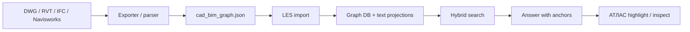
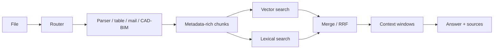

# Л.Е.С.


**Л.Е.С.** - локальная система для инженерной базы знаний.

Если совсем просто: кладем документы, таблицы, письма и CAD/BIM-данные в свою
машину, а потом спрашиваем по ним нормальным языком. Ответ должен быть не
"похоже где-то было", а с опорой на источник: файл, chunk, таблицу, слой,
`GlobalId`, Revit-параметр или объект модели.

Это public snapshot. Здесь нет приватных данных, ключей, рабочих индексов и
закрытых моделей. Зато есть код, схемы, примеры, АТЛАС viewer, CAD/BIM
exporters, install surface и тесты, по которым можно понять архитектуру и
развернуть свой контур.

[Демо АТЛАС](https://les.ovc.me/vv/) · [Установка](INSTALL.md) ·
[CAD/BIM schema](schema/cad_bim_graph.schema.json) ·
[Пример JSON](examples/minimal.cad_bim_graph.json) ·
[Exporters](exporters/) ·
[Standalone АТЛАС](standalone/cad_bim_viewer/)


## Зачем

Обычный RAG хорошо выглядит на демо, но быстро ломается на реальных инженерных
архивах:

- PDF бывают сканами, книгами, нормами, чертежами и мусором;
- таблицы нужно считать, а не пересказывать;
- почта хранит решения, вложения и контекст;
- DWG/RVT/IFC нельзя нормально читать как обычный текст;
- локальная машина может умереть, если одновременно запустить модель, OCR и
  тяжелую индексацию;
- ответ без источника в инженерной работе почти бесполезен.

Л.Е.С. нужен как локальный слой памяти: аккуратно принять данные, распилить,
разложить по индексам, найти нужное и вернуть ответ с проверяемой привязкой.

## Из чего состоит

| Часть | Что делает |
|---|---|
| **Л.Е.С.** | API, ingestion, routing, chunking, Qdrant/SQLite, search, health, runtime safety |
| **АТЛАС** | viewer для IFC и `cad_bim_graph.json`; помогает глазами проверить модель и источник ответа |
| **АРТЕЛЬ** | контур для Revit-семейств: ТЗ, спецификация, проверка RFA, каталог, learning cases |

АТЛАС и АРТЕЛЬ могут жить отдельно. Но смысл экосистемы в том, что они говорят
с Л.Е.С. через понятные JSON-контракты и не плодят второй RAG.

## Что внутри

```text
backend/                  парсинг, адаптеры, документные helpers
proxy/                    FastAPI, retrieval, CAD/BIM import, settings, auth
sovushka/                 локальный UI/admin
frontend/cad_bim_viewer/  исходники АТЛАС
standalone/cad_bim_viewer/готовый offline viewer
exporters/                AutoCAD / Revit / Navisworks exporters
schema/                   JSON-схемы CAD/BIM и ARTEL learning case
examples/                 маленькие public-safe примеры
tools/                    smoke, seed, build и runtime utilities
tests/                    проверки контрактов
```

## CAD/BIM

Главная идея: не пытаться скормить RAG бинарный DWG или RVT напрямую.

Сначала инженерная модель превращается в нормальный JSON:

```text
cad_bim_graph.json = elements + relations + properties + display geometry
```

Потом Л.Е.С. индексирует текстовые проекции и объектные связи. АТЛАС открывает
тот же JSON и показывает, что именно попало в базу.




Что сохраняется:

- DWG/DXF: слои, линии, дуги, polyline, тексты, handles;
- Revit/RVT: элементы, категории, типы, параметры, уровни, display geometry;
- IFC: `GlobalId`, property sets, spatial structure, типы элементов;
- Navisworks: дерево, свойства, instance GUID, bbox/preview.

## Документы, таблицы, почта

Л.Е.С. не только про CAD/BIM.

- PDF, DOCX, DOC, MD, TXT: документный router, chunking, источники.
- XLSX, XLS, CSV: табличный канал, row-level chunks, детерминированные ответы
  там, где нужно считать.
- EML, EMLX, MSG, IMAP/Apple Mail: письма, участники, вложения, цепочки.
- JSON/JSONL: прямой ingestion структурированных данных.

## Почему важны router и chunking

Плохой RAG обычно начинается не с плохой модели, а с плохой подготовки данных.

В Л.Е.С. файл сначала маршрутизируется: нормативка, таблица, письмо, CAD/BIM,
ARTEL learning case и так далее. Потом выбирается pipeline и metadata. Chunk
получает контекст: dataset, document type, порядок, источник, anchors.



Именно это дает нормальные ответы по инженерному корпусу: вопрос по смете не
должен искать как вопрос по СП, а ответ по BIM-элементу должен иметь объектный
anchor.

## Memory safety

Локальный RAG легко убить: модель, embeddings, OCR, PDF parser и UI начинают
бороться за одну память.

Поэтому в Л.Е.С. есть runtime profiles и admission control:

- `CHAT`
- `INDEX_LIGHT`
- `INDEX_HEAVY_PDF`
- `MAINTENANCE`
- memory states `GREEN / YELLOW / RED / CRITICAL`

Система смотрит на RAM/swap, активные jobs и режим работы. Если сейчас опасно
генерировать или индексировать, она должна остановиться понятным образом, а не
сломать индекс.

Важный практический показатель: health сверяет SQLite chunks и Qdrant points.
Если `points_match_sqlite_chunks=true`, значит векторная база и метаданные не
разъехались.

## Windows / Linux / Mac

Первый референсный runtime был на Mac/Apple Silicon с локальным MLX. Но коробка
не должна быть только для Mac.

Текущие профили:

- **mac-native**: локальный MLX/CoreML runtime, Qdrant, proxy, UI.
- **windows-lite**: Qdrant + LES proxy + UI, без MLX; генерация через
  OpenAI-compatible provider.
- **linux-docker / windows-docker**: контейнерный контур.

Для Windows light подходят:

- Lemonade
- Ollama
- OpenRouter
- OpenAI
- любой OpenAI-compatible endpoint

Это один принцип: `base_url + model + api_key`.

## Быстрый старт

```bash
git clone https://github.com/proovcme/les_rag_public.git
cd les_rag_public
uv sync
cp env.example .env
```

Mac:

```bash
uv run lesctl init --profile mac-native
uv run lesctl start --profile mac-native --include-ui
```

Windows light:

```powershell
powershell -ExecutionPolicy Bypass -File .\installers\windows\install.ps1 -Profile windows-lite -InitEnv -Sync
powershell -ExecutionPolicy Bypass -File .\installers\windows\start-light.ps1 -Provider lemonade -StartQdrant
```

Открыть:

```text
http://127.0.0.1:8051/
http://127.0.0.1:8051/les
http://127.0.0.1:8050/api/health
```

Пустой fresh install может вернуть `status=degraded` и `rag.status=empty`.
Это нормально: runtime поднят, но корпус еще не загружен.

## АТЛАС отдельно

АТЛАС standalone можно запустить без Л.Е.С., npm и интернета:

```bash
cd standalone/cad_bim_viewer
./serve.sh 8095
```

Windows:

```powershell
powershell -ExecutionPolicy Bypass -File .\serve.ps1 -Port 8095
```

Открыть:

```text
http://127.0.0.1:8095/?source=models/demo.cad_bim_graph.json
```

## АРТЕЛЬ

АРТЕЛЬ - это направление для Revit family factory.

Идея такая:

```text
задание -> спецификация -> RFA -> validation report -> catalog -> learning case -> LES
```

Л.Е.С. хранит требования, ФОП/shared parameters, Revit API notes, validation
reports и learning cases. Тогда следующая семья делается не с нуля, а от
проверенной памяти.

В public snapshot есть схема learning case и маленький пример:

```text
schema/artel_family_learning_case.schema.json
examples/artel/family_learning_case.metal_cabinet.json
```

## Что важно

- Это не SaaS. Базовая идея - локальный/private runtime.
- Public repo не содержит приватных документов, индексов, ключей и RFA.
- Raw RVT/DWG лучше не индексировать напрямую. Надежнее exporter -> JSON.
- Ответ без источника не считается хорошим ответом.
- Большие PDF и тяжелый OCR должны идти через guarded режим, а не в общий чат.
- Windows light без LLM на машине - нормальный режим, если подключен
  OpenAI-compatible provider.

## Что дальше

Ближайшие цели:

- довести Windows service wrapper для `windows-lite`;
- упаковать release artifacts по профилям;
- расширить CAD/BIM exporters и regression samples;
- посадить локальную Revit API/SDK базу из скачанных источников;
- прогнать АРТЕЛЬ на реальных RFA через Revit add-in;
- копить accepted/rejected learning cases;
- сделать больше честных end-to-end smoke сценариев.

## Проверки

В public snapshot обычно гоняются:

```bash
uv lock --check
uv run pytest -q
uv run python tools/runtime_smoke.py --proxy-url http://127.0.0.1:8050 --ui-url http://127.0.0.1:8051
```

Для АТЛАС:

```bash
uv run python tools/smoke_atlas_standalone.py
```

## English Short Version

LES is a local-first engineering RAG system. It indexes documents, tables, mail
and CAD/BIM JSON graphs, then answers with source anchors. ATLAS is the
standalone CAD/BIM viewer. ARTEL is the Revit family workflow layer. The public
repo contains code, schemas, examples, exporters and install surfaces, but no
private data or production indexes.
