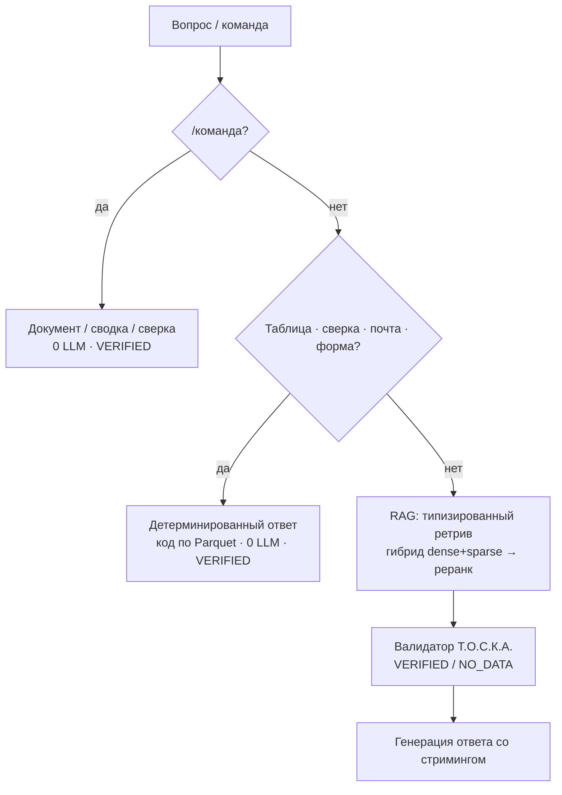
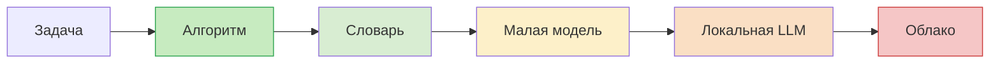
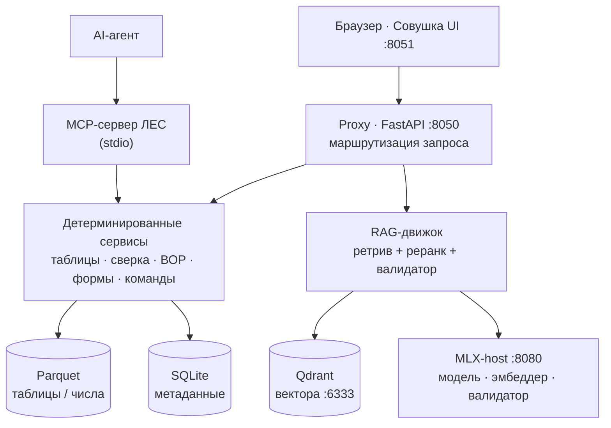

# Л.Е.С. — локальный центр данных строительного проекта


> ИИ-среда общих данных (СОД) и агент-помощник РП/ГИП для стройки. Собирает нормы, проект,
> сметы, переписку и таблицы в **один локальный центр**, отвечает со ссылкой на пункт и
> **считает по документам кодом, а не нейросетью**.

---

## Зачем

Информация по строительному проекту разбросана: нормы — в PDF, проект — по разделам РД,
переписка — в почте, сметы — в Excel, модели — в BIM. Найти нужный пункт нормы — квест.
А если спросить обычную нейросеть «сколько кабеля в этой смете на 93 позиции» — получишь
уверенное **враньё** (LLM не считает, она «прикидывает правдоподобный ответ»).

**Л.Е.С. решает это:** один локальный центр на все документы проекта, ответы со ссылкой на
конкретный пункт и проверяемым статусом, а числа по сметам/ведомостям считает
детерминированный код — бит-в-бит, а не на глаз.

```text
Вопрос:  «Сколько кабеля 3×1,5 в смете?»
Ответ:   «Количество (кабель 3х1,5): 15 030,72 м» [VERIFIED · route=table · 0 LLM]

Вопрос:  «Минимальная ширина пути эвакуации по СП 1.13130?»
Ответ:   «Не менее 1,2 м (п. 4.3.4 СП 1.13130.2022)» [VERIFIED]
         Источник: СП 1.13130.2022.pdf, стр. 12
```

## Сильные стороны

- 🔢 **Числа считает код, не нейросеть.** Суммы, объёмы, сверки — детерминированно по Parquet. Кабель 3×1,5 = 15 030,72 м совпало с ручным расчётом бит-в-бит (обычный RAG выдавал 5900 — терял строки в top-k).
- 🔒 **Local-first и приватно.** Векторная база, модели и UI — на вашей машине. Данные класса P0 (почта, договоры, ПДн) физически не уходят в облако. Облако — опционально, только для качества языка.
- 📦 **Всё в одном (СОД).** Нормы + проект по разделам + почта + сметы + BIM/CAD — единый индекс, ответы со ссылками на пункты.
- ✅ **Проверяемые инструменты, не «магия».** Сверка ВОР↔КС-2↔смета, ВОР из спецификаций, типовые формы по ГОСТ — каждый результат прослеживается к исходным строкам.
- 🔌 **Открыт наружу как MCP-сервер.** Инструменты Л.Е.С. вызываются из Claude Code / Desktop / IDE по Model Context Protocol.
- 🧭 **LLM — последний инструмент** (ADR-11). Лесенка: алгоритм → словарь → малая модель → локальная LLM → облако. Большую модель зовём только там, где правда нужен язык.

---

## Как это работает

Детерминированные каналы (команды, таблицы, сверка, почта, формы) срабатывают **до**
семантического поиска. Не подошло — обычный RAG. Числа считает код, не модель.



**Лесенка выбора инструмента (LLM — последней):**



## Архитектура



**Стек:** Python 3.12 (uv) · FastAPI · NiceGUI · Qdrant · MLX / `mlx-lm` / Core ML ·
llama-index · Parquet (pyarrow) · SQLite · launchd (macOS, без Docker) · опц. облако.

Карта кода — [docs/CODE_MAP.md](docs/CODE_MAP.md). Гид для агентов — [AGENTS.md](AGENTS.md).

---

## Функции

### Поиск и ответы (RAG)
- Ответ со ссылкой на конкретный пункт нормы, статус `VERIFIED / NO_DATA`.
- Типизированный многоуровневый ретрив (класс → документ → пункт): мостит вокабулярный разрыв «серверная → помещение ЭВМ → СП 486».
- Мультикласс через диалог (чипы-варианты «посмотреть как…»).
- Форма ответа по интенту: «значение» → строка с пунктом, «расскажи» → сжато, «собери всё» → развёрнуто.
- Память диалога + авто-заметки фактов.

### Таблицы и числа (0 LLM)
- **Счёт по таблицам** — суммы/количества по полному Parquet (доказано бит-в-бит).
- **ВОР** — свод из спецификаций; **ВОР работ из спецификации** (форма 9 ГОСТ 21.110).
- **Сверка** ВОР ↔ КС-2 ↔ смета ↔ ИД по количествам (флаги расхождений).
- **План/факт** — ВОР ↔ журнал полевых объёмов.
- **Сводка проекта** — стадия (ПД/РД), ТЭП, состав *(каркас, ТЭП калибруется на реальных доках)*.

### Документы и формы
- Типовые формы по стандартам → docx/xlsx/html: **спецификация** (ГОСТ 21.110), **ВОР**, **смета (ЛСР 421/пр)**, **АОСР**.
- Формальный нормоконтроль, дифф ревизий моделей и текстов.

### Приём данных
- Форматы: PDF, DOCX/DOC, XLSX/XLS, PPTX, CSV, EML/MSG, DWG/IFC, MD/TXT/JSON.
- Индексация **внешней папки по ссылке** (in-place, без копий) + серверный браузер папок.
- Почта: **IMAP** (Outlook / Microsoft 365 / Outlook.com), архивы **.olm** (Mac), **.pst** (Windows, libpff), **.msg**, Apple Mail.
- OCR сканов через локальный vision (Gemma).

### Интерфейсы
- **Чат-команды** (`/`-палитра): `/спецификация`, `/вор`, `/смета`, `/акт`, `/сверка`, `/сводка`, `/команды`.
- **GUI «Совушка»** (NiceGUI): чат, датасеты, инструменты, журналы объёмов.
- **REST API** (FastAPI).
- **MCP-сервер**: `les_table_sum`, `les_reconcile`, `les_bor`, `les_spec_to_bor`, `les_project_summary`, `les_form_generate`.

### АРТЕЛЬ (отдельный модуль, экспериментальный)
Генератор семейств Revit: vision-классификация архетипа → детерминированный план → исполнение в Revit (Windows+Revit пакет).

---

## Запуск

```bash
uv sync --extra mac-mlx        # зависимости (mlx-lm под Apple Silicon)
cp env.example .env            # ключи/пути
make verify                    # офлайн-гейт: синтаксис + импорт-смоук
uv run lesctl start            # поднять сервисы (Qdrant / MLX / proxy / Совушка)
```

Опц. возможности — extras: `mail-pst` (.pst, libpff), `mcp` (MCP-сервер), `parsers` (layout-aware PDF).
MCP-сервер: `uv run python tools/les_mcp_server.py --list`. Рантайм/доступы — [SKILL.md](SKILL.md).

---

## Дорожная карта

**Готово**
- ✅ Детерминированный счёт по таблицам, ВОР, спец→ВОР, сверка, план/факт
- ✅ Типовые формы по стандартам, нормоконтроль, дифф
- ✅ Приём почты (IMAP/Outlook, .olm/.pst/.msg/Apple Mail), внешние папки in-place, OCR→Gemma
- ✅ Чат-команды (`/`-палитра), память диалога, авто-заметки
- ✅ MCP-сервер (инструменты Л.Е.С. наружу)

**Ближайшее**
- 🚧 Калибровка ТЭП-экстрактора и «сводки проекта» на реальных проектах
- 🚧 Автозаполнение форм из данных объекта
- ⏳ Fuzzy-match наименований для сверки план/факт
- ⏳ Мультикласс end-to-end (ответ секциями)
- ⏳ Авто-синхрон почты по расписанию
- ⏳ Тюнинг валидатора Т.О.С.К.А. и OCR-качества
- ⏳ MCP-клиент (точечно, под внешние действия) · АРТЕЛЬ MEP-коннекторы · голос (Whisper)

---

## Статус и приватность

Исследовательско-полевой self-hosted appliance для Apple Silicon; часть возможностей —
рабочий каркас в калибровке (помечено выше). Штатный рантайм полностью локальный; данные
класса P0 не уходят в облако; внешний доступ — relay до локального хоста через приватную сеть.
Открытая лицензия не объявлена — проект приватный.
