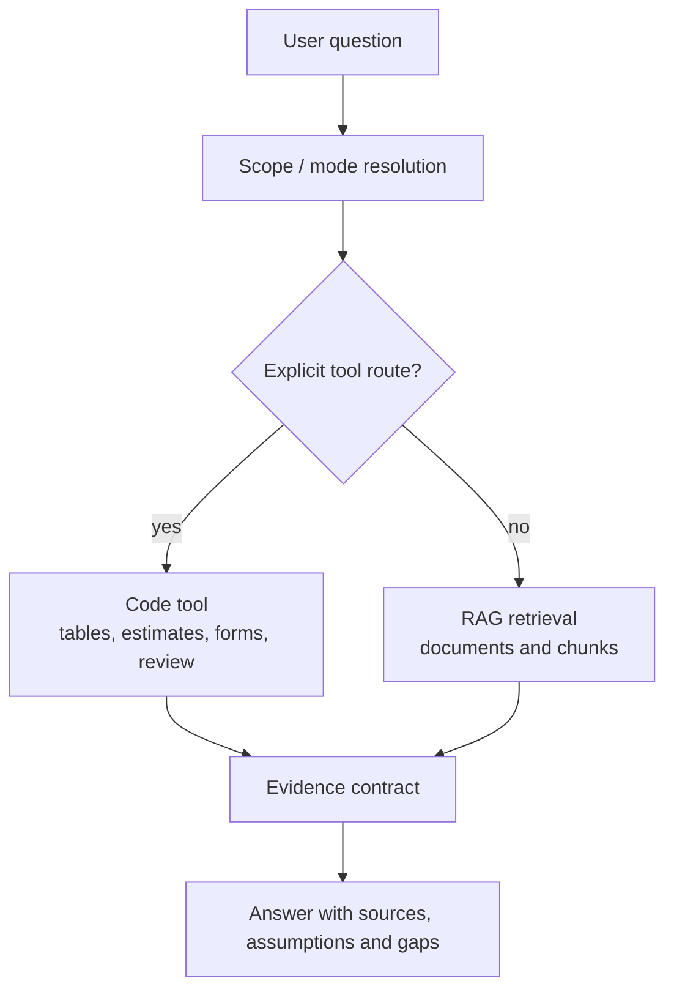

# LES / Л.Е.С.

Local Evidence System for construction documents, estimates and project data.

Л.Е.С. is a local-first evidence harness for construction work. It helps an engineer search project documents, standards, estimates, tables, mail and CAD/BIM exports, then answer with sources, computed values and explicit gaps.

The core rule is simple:

**the model connects language and evidence; code computes numbers.**

## What It Is

LES is not "a chatbot over PDFs". It is a workflow layer around project data:

- document and table ingestion;
- RAG over indexed project and normative corpora;
- deterministic calculations over tables and Parquet;
- estimate helpers for GESN/FGIS/LSR workflows;
- document review and normcontrol reports;
- project memory and dataset passports;
- API, web UI and MCP tools for external agents.

The system is designed for cases where a wrong confident answer is worse than no answer. A result should say where it came from:

- `RETRIEVED`: found in a source;
- `COMPUTED`: calculated by code;
- `ASSUMED`: accepted as an assumption;
- `MISSING`: required data is absent;
- `BLOCKED`: the workflow should not continue without more evidence.

## What It Does Well

- Answers questions over indexed project/normative documents with source references.
- Computes quantities, sums and reconciliations from structured tables.
- Builds and checks bill-of-quantities style outputs from specifications.
- Helps assemble estimate workflows using local GESN/FGIS/price data where available.
- Keeps chat and dataset context as navigation memory, not as proof.
- Exposes deterministic tools through HTTP and MCP.
- Runs local-first on Apple Silicon with optional external model providers.

## What It Does Not Promise

- It does not make final engineering or normcontrol decisions for a human.
- It does not treat LLM text as a reliable calculator.
- It does not silently turn rough object analogues into defensible estimates.
- It does not guarantee that every request is handled before RAG by a deterministic route.

Some routes are intentionally deterministic and can answer before semantic search: commands, selected table calculations, selected estimate tools, task/memory commands and other explicit tool workflows. Other requests go through scope resolution, profile/router gates and then RAG. If a deterministic tool does not have enough structured evidence, LES should say so instead of pretending.

## High-Level Flow



## Typical Use Cases

- "Find the fire-safety requirement and show the source."
- "Sum this cable type across all estimate sheets."
- "Compare BoQ, KS-2, estimate and field records."
- "Prepare a rough object estimate and list what is not defensible yet."
- "Review a project PDF against a normcontrol checklist."
- "Create a dataset passport so the system can understand what is inside."

## Local Runtime

The usual local stack is:

- Python 3.12 with `uv`;
- FastAPI proxy;
- NiceGUI web UI;
- Qdrant;
- SQLite metadata;
- Parquet for structured tables;
- MLX/Core ML local models on Apple Silicon.

Basic developer check:

```bash
uv sync
make verify
```

Runtime deployment and private operator procedures are intentionally not documented in this public README.

## Repository Status

This public repository is a source-available technical snapshot of LES code. It does not include private datasets, indexed corpora, customer files, runtime databases, model caches, logs or secrets.

Some workflows require local service data such as GESN/FGIS price books, project datasets or layout references. Without those sources, LES should return a degraded or missing-data result rather than inventing evidence.

## License And Security

See [LICENSE](LICENSE) and [SECURITY.md](SECURITY.md).
