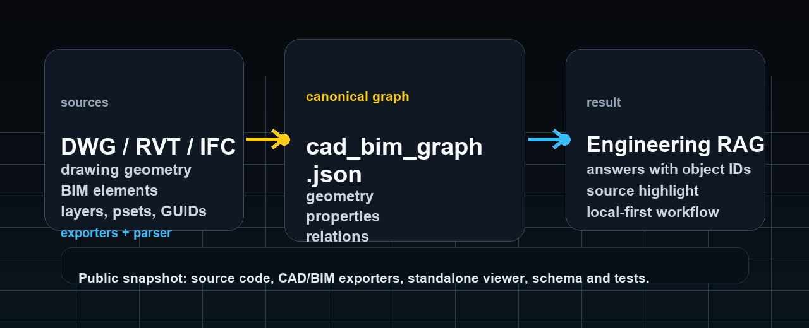
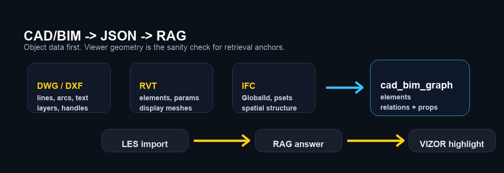
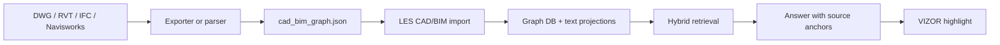

# LES RAG Public



**RU:** LES - локальная инженерная RAG-система. Она превращает документы, таблицы и CAD/BIM-модели в проверяемую базу знаний: ответ должен ссылаться не на "примерно страницу", а на источник, фрагмент, объект чертежа или BIM-элемент.

**EN:** LES is a local-first engineering RAG system. It turns documents, tables and CAD/BIM models into a verifiable knowledge base: an answer should point back to a source, a chunk, a drawing object or a BIM element.

[Live VIZOR viewer](https://les.ovc.me/vv/) · [Install](INSTALL.md) · [CAD/BIM JSON exporters](exporters/) · [Standalone viewer](standalone/cad_bim_viewer/) · [JSON schema](schema/cad_bim_graph.schema.json)

## RU - что это

LES состоит из трех частей:

1. **RAG runtime** - backend/proxy, индексация, retrieval, маршрутизация запросов, безопасная выдача ответа с источниками.
2. **CAD/BIM JSON bridge** - экспортеры для AutoCAD, Revit и Navisworks плюс IFC/DXF extractors. Их задача - превратить инженерную модель в `cad_bim_graph.json`.
3. **VIZOR** - WebGL-смотрелка для `*.cad_bim_graph.json` и IFC. Она нужна не для красоты ради красоты, а для контроля: если JSON можно нарисовать обратно, значит данные не умерли по дороге в RAG.



### Что умеет кроме CAD/BIM

CAD/BIM - самый заметный кусок, но не единственный. В public snapshot также есть:

- **Документы:** PDF, DOCX, DOC, Markdown, TXT, базовая маршрутизация документов по типу и домену.
- **Таблицы:** XLSX, XLS, CSV, табличный канал запросов, отдельная логика для смет, спецификаций и ведомостей.
- **Почта:** `.eml`, `.emlx`, `.msg`, Apple Mail import, IMAP import, цепочки писем, участники, вложения, OCR вложений.
- **Гибридный retrieval:** vector search + lexical FTS + RRF merge, rerank where available, context windows around chunks.
- **Безопасность runtime:** режимы `CHAT`, `INDEX_LIGHT`, `INDEX_HEAVY_PDF`, `MAINTENANCE`, memory pressure states, admission control, блокировка генерации во время тяжелой индексации.
- **Взрослый chunking/router:** deterministic document routing, domain datasets, chunk metadata, parent/child/order anchors, route-change reindex utilities.

### Зачем это нужно

Обычный RAG плохо понимает CAD/BIM-файлы. DWG для него часто выглядит как темный бинарный лес, RVT требует Autodesk API, IFC содержит много данных, но их надо правильно связать с геометрией и `GlobalId`.

LES делает другой путь:

- DWG/DXF: линии, дуги, тексты, слои, координаты, handles.
- RVT: элементы, категории, параметры, уровни, display geometry.
- IFC: `GlobalId`, property sets, пространственная структура, типы элементов.
- Navisworks: дерево модели, свойства, instance GUID, bounding-box preview.

Все это приводится к одному формату:

```text
cad_bim_graph.json = elements[] + relations[] + properties + display geometry
```

После этого RAG может искать не только по тексту, но и по инженерным объектам. Ответ можно привязать к конкретному слою, handle, `GlobalId`, категории или связи. VIZOR может подсветить источник ответа в модели.

### Как работает поток CAD/BIM RAG



Алгоритм в упрощенном виде:

1. Экспортер извлекает объектную структуру из исходника.
2. Каждый объект получает стабильный идентификатор: `handle`, `UniqueId`, `GlobalId` или source GUID.
3. Геометрия приводится к display/QA-форме: линия, дуга, polyline, mesh, bbox.
4. Свойства нормализуются в JSON.
5. Связи сохраняются отдельно: containment, annotation, system relation, spatial relation.
6. LES строит graph store и текстовые проекции для RAG.
7. Ответ возвращает не только текст, но и anchors, которые можно открыть в viewer.

### Что лежит в public snapshot

```text
backend/                  document parsing, indexing helpers, adapters
proxy/                    FastAPI proxy, retrieval and CAD/BIM import services
sovushka/                 local admin/chat UI components
frontend/cad_bim_viewer/  VIZOR source app
standalone/cad_bim_viewer/ready-to-run offline VIZOR bundle
exporters/                AutoCAD, Revit, Navisworks JSON exporters
tools/                    smoke, extraction and build utilities
tests/                    regression tests for core contracts
schema/                   public cad_bim_graph JSON schema
examples/                 small public JSON sample
```

### Как поставить

Коротко: **VIZOR ставится просто**, полный LES runtime ставится как developer/local stack.

- Для viewer без LES: смотри [`standalone/cad_bim_viewer/`](standalone/cad_bim_viewer/).
- Для полного runtime: смотри [`INSTALL.md`](INSTALL.md).

Публичный репозиторий не содержит приватные индексы, корпуса, model weights, Core ML artifacts, ключи и production deployment state. Поэтому после установки нужно отдельно скачать модели, поднять Qdrant и проиндексировать свои данные.

### Быстрый запуск VIZOR без LES

macOS/Linux:

```bash
cd standalone/cad_bim_viewer
./serve.sh 8095
```

Windows PowerShell:

```powershell
cd standalone\cad_bim_viewer
powershell -ExecutionPolicy Bypass -File .\serve.ps1 -Port 8095
```

Открой:

```text
http://127.0.0.1:8095/
```

Можно загрузить локальный `*.cad_bim_graph.json` или IFC через кнопку `Добавить`. Интернет и LES backend для этого режима не нужны.

### Быстрый импорт CAD/BIM JSON в локальный LES

```bash
curl -X POST http://127.0.0.1:8050/api/cad-bim/import \
  -H "Content-Type: application/json" \
  -H "X-API-Key: $LES_ADMIN_KEY" \
  -d '{"source_path":"RAG_Content/CAD_BIM/JSON/model.cad_bim_graph.json","source_type":"revit"}'
```

### Экспортеры

Экспортеры лежат в [`exporters/`](exporters/):

- AutoCAD: `LESJSONEXPORT`, `LESJSONPUSH`, `LESJSONCONFIG`.
- Revit: `Export JSON`, `Push to LES`, `Config`.
- Navisworks: `LES JSON Export`, `LES JSON Push`, `LES JSON Config`.

Один и тот же плагин может:

- сохранить JSON локально;
- отправить в локальный LES;
- отправить в адрес `/api/cad-bim/import`;
- работать через shared config в `%APPDATA%\LES\cad_bim_exporter_settings.json`.

### Ограничения

Это честный public snapshot, а не production dump.

- В репозитории нет приватных корпусов, индексов, ключей, логов, machine-specific deployment state и model weights.
- DWG/RVT/Navisworks экспорт требует Windows и установленный Autodesk-продукт.
- IFC parsing зависит от размера и качества модели; некоторые тяжелые infra samples могут требовать отдельного timeout/fragment pipeline.
- Геометрия в `cad_bim_graph.json` используется для viewer QA и RAG anchors. Это не замена точной геометрии авторского CAD/BIM-ядра.
- Speckle не является обязательной частью этого публичного пути. Основной путь - JSON-first.
- Почтовый контур требует собственные учетные данные IMAP или локальный Apple Mail store; секреты не хранятся в репозитории.
- Полный LES runtime рассчитан на локальную/dev установку. Это не one-click SaaS installer.
- Лицензия пока не назначена. Если нужен production/commercial use, свяжитесь с владельцем репозитория.

## EN - what this is

LES has three main parts:

1. **RAG runtime** - backend/proxy, indexing, retrieval, query routing and source-grounded answer generation.
2. **CAD/BIM JSON bridge** - AutoCAD, Revit and Navisworks exporters plus IFC/DXF extraction tools. Their job is to produce `cad_bim_graph.json`.
3. **VIZOR** - a WebGL viewer for `*.cad_bim_graph.json` and IFC. It is not only a viewer. It is a sanity check: if JSON can be drawn back into a scene, the RAG layer is working with real source objects, not a dead export.

### Beyond CAD/BIM

CAD/BIM is the most visible part, but LES is broader:

- **Documents:** PDF, DOCX, DOC, Markdown, TXT and deterministic document routing.
- **Tables:** XLSX, XLS, CSV, table query channel, estimates, specifications and schedules.
- **Mail:** `.eml`, `.emlx`, `.msg`, Apple Mail import, IMAP import, conversation threads, participants, attachments and attachment OCR.
- **Hybrid retrieval:** vector search + lexical FTS + RRF merge, optional reranking and context windows around chunks.
- **Runtime safety:** `CHAT`, `INDEX_LIGHT`, `INDEX_HEAVY_PDF`, `MAINTENANCE`, memory pressure states, admission control and chat blocking during heavy indexing.
- **Chunking/router:** document routing, domain datasets, chunk metadata, parent/child/order anchors and guarded route-change reindex tools.

### Why it exists

Classic RAG is weak on CAD/BIM files. DWG is often opaque binary geometry, RVT needs Autodesk APIs, and IFC has rich data but needs careful mapping between geometry, properties and stable IDs.

LES uses a JSON-first route:

- DWG/DXF: lines, arcs, text, layers, coordinates, handles.
- RVT: elements, categories, parameters, levels, display geometry.
- IFC: `GlobalId`, property sets, spatial structure, element classes.
- Navisworks: model tree, properties, instance GUIDs, bounding-box preview geometry.

The result is one canonical graph:

```text
cad_bim_graph.json = elements[] + relations[] + properties + display geometry
```

RAG can then search across engineering objects, not only plain text. Answers can carry object anchors. VIZOR can use those anchors to show or highlight the source element.

### CAD/BIM RAG flow


### Included

```text
backend/                  document parsing, indexing helpers, adapters
proxy/                    FastAPI proxy, retrieval and CAD/BIM import services
sovushka/                 local admin/chat UI components
frontend/cad_bim_viewer/  VIZOR source app
standalone/cad_bim_viewer/ready-to-run offline VIZOR bundle
exporters/                AutoCAD, Revit, Navisworks JSON exporters
tools/                    smoke, extraction and build utilities
tests/                    regression tests for core contracts
schema/                   public cad_bim_graph JSON schema
examples/                 small public JSON sample
```

### Installation

Short version: **VIZOR is ready to run**, the full LES runtime is a developer/local stack.

- Viewer without LES: see [`standalone/cad_bim_viewer/`](standalone/cad_bim_viewer/).
- Full runtime: see [`INSTALL.md`](INSTALL.md).

The public repository does not include private indexes, corpora, model weights, Core ML artifacts, secrets or production deployment state. After installation you still need to download models, start Qdrant and index your own data.

### Run VIZOR without LES

macOS/Linux:

```bash
cd standalone/cad_bim_viewer
./serve.sh 8095
```

Windows PowerShell:

```powershell
cd standalone\cad_bim_viewer
powershell -ExecutionPolicy Bypass -File .\serve.ps1 -Port 8095
```

Open:

```text
http://127.0.0.1:8095/
```

Load a local `*.cad_bim_graph.json` or IFC file with `Добавить` / Add. This mode does not require the LES backend or internet access.

### Import CAD/BIM JSON into local LES

```bash
curl -X POST http://127.0.0.1:8050/api/cad-bim/import \
  -H "Content-Type: application/json" \
  -H "X-API-Key: $LES_ADMIN_KEY" \
  -d '{"source_path":"RAG_Content/CAD_BIM/JSON/model.cad_bim_graph.json","source_type":"ifc"}'
```

### Exporters

The exporter sources are in [`exporters/`](exporters/):

- AutoCAD: `LESJSONEXPORT`, `LESJSONPUSH`, `LESJSONCONFIG`.
- Revit: `Export JSON`, `Push to LES`, `Config`.
- Navisworks: `LES JSON Export`, `LES JSON Push`, `LES JSON Config`.

The same plugin can save JSON locally, push into local LES, POST to `/api/cad-bim/import`, or use the shared config at:

```text
%APPDATA%\LES\cad_bim_exporter_settings.json
```

### Limitations

This is a public snapshot, not a production dump.

- Private corpora, indexes, keys, logs, machine-specific deployment state and model weights are not included.
- DWG/RVT/Navisworks export requires Windows and installed Autodesk products.
- IFC parsing depends on model size and quality; some heavy infrastructure samples may need a longer timeout or a fragment-first pipeline.
- Geometry in `cad_bim_graph.json` is display/QA geometry for viewer and RAG anchors. It does not replace exact authoring-kernel geometry.
- Speckle is not required for the public JSON-first workflow.
- Mail ingestion requires your own IMAP credentials or local Apple Mail store. Secrets are not committed.
- The full LES runtime is a local/developer installation, not a one-click SaaS installer.
- No license has been assigned yet. For production or commercial use, contact the repository owner.
