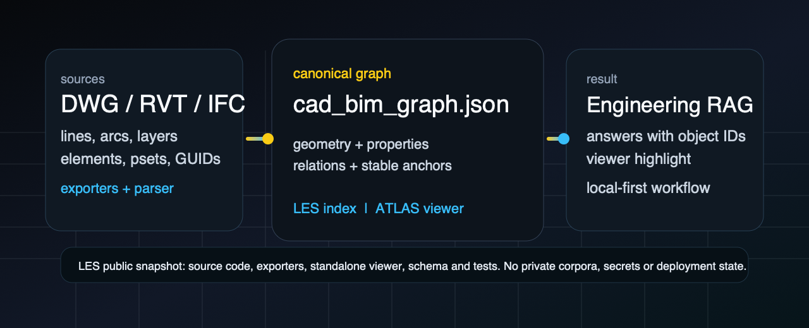
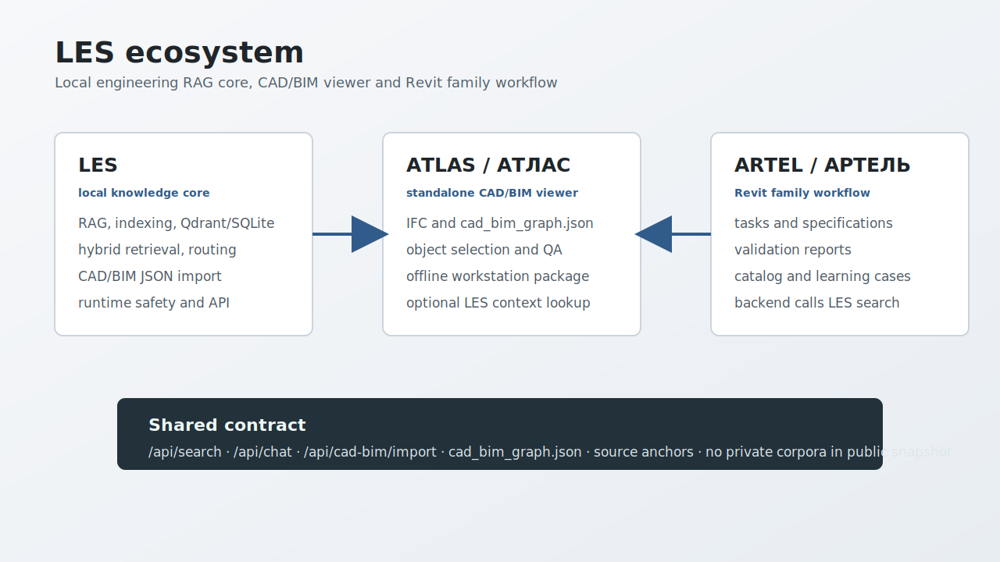
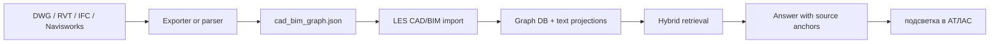
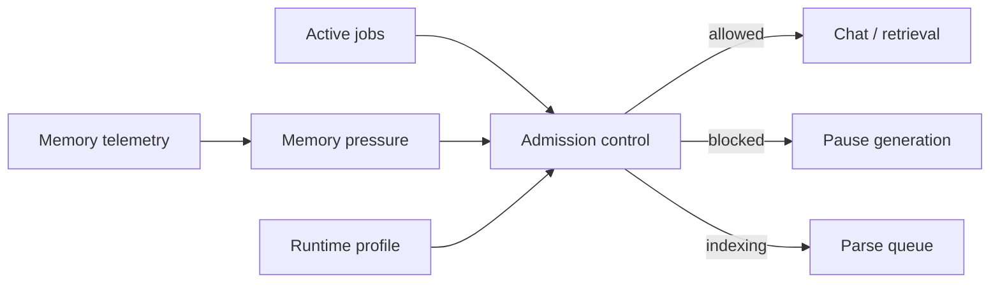
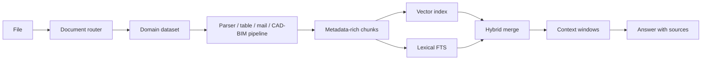
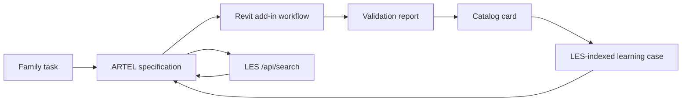
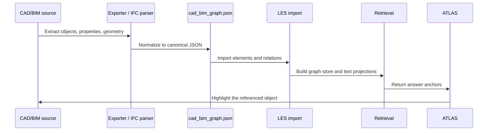

# LES RAG Public



**RU:** LES - локальная инженерная RAG-система и основа экосистемы **LES / АТЛАС / АРТЕЛЬ**. Она превращает документы, таблицы, почту и CAD/BIM-модели в проверяемую базу знаний: ответ должен ссылаться не на "примерно страницу", а на источник, фрагмент, объект чертежа, BIM-элемент или карточку жизненного цикла Revit-семейства.

**EN:** LES is a local-first engineering RAG system and the core of the **LES / ATLAS / ARTEL** ecosystem. It turns documents, tables, mail and CAD/BIM models into a verifiable knowledge base: an answer should point back to a source, a chunk, a drawing object, a BIM element or a Revit family lifecycle record.

[Live ATLAS viewer](https://les.ovc.me/vv/) · [Install](INSTALL.md) · [CAD/BIM JSON exporters](exporters/) · [Standalone viewer](standalone/cad_bim_viewer/) · [CAD/BIM schema](schema/cad_bim_graph.schema.json) · [ARTEL schema](schema/artel_family_learning_case.schema.json)



## RU - что это

Экосистема состоит из трех продуктов, которые могут жить отдельно, но говорят через одни контракты:

| Продукт | Роль | Что делает |
|---|---|---|
| **LES** | локальное ядро знаний | ingestion, индексация, Qdrant/SQLite, hybrid retrieval, runtime safety, API |
| **АТЛАС** | CAD/BIM viewer | открывает IFC и `cad_bim_graph.json`, проверяет геометрию/объекты, может использовать LES context |
| **АРТЕЛЬ** | Revit family workflow | задания, спецификации, проверка RFA, каталог, learning loop; backend ходит в LES за RAG-контекстом |

В этом public snapshot основной код - LES и АТЛАС. АРТЕЛЬ описана как продуктовый контур и интеграционный следующий слой: Revit-плагин должен ходить в backend АРТЕЛИ, а backend АРТЕЛИ - в LES `/api/search`. Так не появляется второй RAG, и вся память качества остается в одном инженерном ядре. Для проверки есть public-safe `FamilyLearningCase` seed, который индексируется в `ARTEL_Index`.

Технически LES состоит из трех слоев:

1. **RAG runtime** - backend/proxy, индексация, retrieval, маршрутизация запросов, безопасная выдача ответа с источниками.
2. **CAD/BIM JSON bridge** - экспортеры для AutoCAD, Revit и Navisworks плюс IFC/DXF extractors. Их задача - превратить инженерную модель в `cad_bim_graph.json`.
3. **АТЛАС** - WebGL-смотрелка для `*.cad_bim_graph.json` и IFC. Она нужна не для красоты ради красоты, а для контроля: если JSON можно нарисовать обратно, значит данные не умерли по дороге в RAG.


### Что умеет кроме CAD/BIM

CAD/BIM - самый заметный кусок, но не единственный. В public snapshot также есть:

- **Документы:** PDF, DOCX, DOC, Markdown, TXT, базовая маршрутизация документов по типу и домену.
- **Таблицы:** XLSX, XLS, CSV, табличный канал запросов, отдельная логика для смет, спецификаций и ведомостей.
- **Почта:** `.eml`, `.emlx`, `.msg`, Apple Mail import, IMAP import, цепочки писем, участники, вложения, OCR вложений.
- **Гибридный retrieval:** vector search + lexical FTS + RRF merge, rerank where available, context windows around chunks.
- **Безопасность runtime:** режимы `CHAT`, `INDEX_LIGHT`, `INDEX_HEAVY_PDF`, `MAINTENANCE`, memory pressure states, admission control, блокировка генерации во время тяжелой индексации.
- **Взрослый chunking/router:** deterministic document routing, domain datasets, chunk metadata, parent/child/order anchors, route-change reindex utilities.

### Зачем это нужно

Обычный RAG плохо понимает CAD/BIM-файлы. DWG для него часто выглядит как темный бинарный лес, RVT требует Autodesk API, IFC содержит много данных, но их надо правильно связать с геометрией и `GlobalId`.

LES делает другой путь:

- DWG/DXF: линии, дуги, тексты, слои, координаты, handles.
- RVT: элементы, категории, параметры, уровни, display geometry.
- IFC: `GlobalId`, property sets, пространственная структура, типы элементов.
- Navisworks: дерево модели, свойства, instance GUID, bounding-box preview.

Все это приводится к одному формату:

```text
cad_bim_graph.json = elements[] + relations[] + properties + display geometry
```

После этого RAG может искать не только по тексту, но и по инженерным объектам. Ответ можно привязать к конкретному слою, handle, `GlobalId`, категории или связи. АТЛАС может подсветить источник ответа в модели.

### Как работает поток CAD/BIM RAG



Алгоритм в упрощенном виде:

1. Экспортер извлекает объектную структуру из исходника.
2. Каждый объект получает стабильный идентификатор: `handle`, `UniqueId`, `GlobalId` или source GUID.
3. Геометрия приводится к display/QA-форме: линия, дуга, polyline, mesh, bbox.
4. Свойства нормализуются в JSON.
5. Связи сохраняются отдельно: containment, annotation, system relation, spatial relation.
6. LES строит graph store и текстовые проекции для RAG.
7. Ответ возвращает не только текст, но и anchors, которые можно открыть в viewer.

### Безопасность памяти и runtime

LES рассчитан на локальную машину, где LLM, embeddings, OCR, парсинг PDF и UI могут конкурировать за одну память. Поэтому runtime устроен не по принципу "запускаем всё сразу".

Это одна из главных инженерных частей LES. Индексация не должна быть рулеткой:
если памяти мало, система должна остановить parse, выгрузить модели, оставить
dataset в понятном состоянии и продолжить позже, а не убить локальный runtime.



В коде есть:

- runtime profiles: `CHAT`, `CHAT_VALIDATED`, `INDEX_LIGHT`, `INDEX_HEAVY_PDF`, `MAINTENANCE`;
- memory states: `GREEN`, `YELLOW`, `RED`, `CRITICAL`;
- пороги свободной RAM и swap pressure;
- блокировка chat generation во время тяжелой индексации;
- ограничение parse concurrency;
- batch parsing и resumable parse queue;
- guarded reindex и route-change reindex;
- MLX memory telemetry и unload hooks.

Что проверяется в health/status:

- сколько файлов `INDEXED`, `PENDING`, `ERROR`;
- сколько chunks создано по dataset/domain/doc_type;
- совпадают ли SQLite chunks и Qdrant points;
- не идет ли активная parse job;
- почему admission control разрешил или запретил действие.

Практический эффект: LES может спокойно принимать большие structured sources,
резать их на сотни chunks, держать pending/error счетчики и не терять
согласованность между SQLite и Qdrant. Если memory guard закрыт, это нормальная
защита, а не поломка.

Это не магия и не замена нормальному sizing машины. Это защита от типичной локальной аварии: "индексатор, OCR и модель одновременно съели память, после чего всё стало медленным или умерло".

### Chunking, routing, retrieval

LES не сводит ingestion к одному splitter на все случаи. Сначала документ маршрутизируется, потом выбирается подходящий pipeline и metadata.



Ключевые детали:

- deterministic document routing по типу, домену и признакам содержимого;
- отдельные каналы для нормативки, таблиц, почты и CAD/BIM;
- chunk metadata: dataset, filename, order, section, parent/child anchors;
- vector retrieval + lexical FTS;
- RRF merge для объединения результатов;
- optional reranking;
- context windows вокруг найденных chunk-ов;
- route-change utilities, чтобы переиндексировать только документы, у которых изменился маршрут.

Практический смысл простой: вопрос по смете не должен искать как вопрос по СП,
письмо не должно теряться среди PDF, а ответ по BIM-элементу должен иметь
объектный anchor. Для инженерных корпусов это важнее красивого демо: качество
ответа начинается не в LLM, а в том, как документ был распознан, распилен,
помечен и потом найден.

### Что лежит в public snapshot

```text
backend/                  document parsing, indexing helpers, adapters
proxy/                    FastAPI proxy, retrieval and CAD/BIM import services
sovushka/                 local admin/chat UI components
sovushka_ng.py            Sovushka NiceGUI entrypoint: / chat, /les admin
frontend/cad_bim_viewer/  исходники АТЛАС
standalone/cad_bim_viewer/готовый offline bundle АТЛАС
exporters/                AutoCAD, Revit, Navisworks JSON exporters
tools/                    smoke, extraction and build utilities
tests/                    regression tests for core contracts
schema/                   public CAD/BIM and ARTEL JSON schemas
examples/                 small public CAD/BIM and ARTEL JSON samples
```

### Где здесь АРТЕЛЬ

АРТЕЛЬ - отдельный продуктовый слой для разработки Revit-семейств. В private LES repo она уже упаковывается как MVP hand-test surface: UI prototype, ASP.NET backend skeleton, OpenAPI и runbook. Public snapshot фиксирует архитектуру и LES-контракты, но не публикует внутренний Revit workflow как готовый production add-in.

Плановая схема:



Что LES должен индексировать для АРТЕЛИ:

- accepted family metadata;
- task specifications;
- shared parameter / FOP patterns;
- validation reports;
- catalog cards;
- known failure patterns;
- RFA/CAD/BIM-derived JSON summaries.

Это превращает разработку семейств в learning loop: каждое принятое семейство улучшает следующую постановку задачи и проверку.

Public-safe проверка без приватных RFA данных:

```bash
uv run python tools/seed_artel_learning_cases.py --verify-search
```

Команда создает markdown-проекцию из [`examples/artel/family_learning_case.metal_cabinet.json`](examples/artel/family_learning_case.metal_cabinet.json),
запускает только `/api/rag/sync/ARTEL` и проверяет non-empty `/api/search`
с `dataset_filter="ARTEL"`.

### Как поставить

Коротко: **АТЛАС ставится просто**, полный LES runtime ставится как developer/local stack.

- Для viewer без LES: смотри [`standalone/cad_bim_viewer/`](standalone/cad_bim_viewer/).
- Для полного runtime: смотри [`INSTALL.md`](INSTALL.md).

Публичный репозиторий не содержит приватные индексы, корпуса, model weights, Core ML artifacts, ключи и production deployment state. Поэтому после установки нужно отдельно скачать модели, поднять Qdrant и проиндексировать свои данные.

### Быстрый запуск АТЛАС без LES

macOS/Linux:

```bash
cd standalone/cad_bim_viewer
./serve.sh 8095
```

Windows PowerShell:

```powershell
cd standalone\cad_bim_viewer
powershell -ExecutionPolicy Bypass -File .\serve.ps1 -Port 8095
```

Открой:

```text
http://127.0.0.1:8095/
```

Можно загрузить локальный `*.cad_bim_graph.json` или IFC через кнопку `Добавить`. Интернет и LES backend для этого режима не нужны.

### Быстрый импорт CAD/BIM JSON в локальный LES

```bash
curl -X POST http://127.0.0.1:8050/api/cad-bim/import \
  -H "Content-Type: application/json" \
  -H "X-API-Key: $LES_ADMIN_KEY" \
  -d '{"source_path":"RAG_Content/CAD_BIM/JSON/model.cad_bim_graph.json","source_type":"revit"}'
```

### Экспортеры

Экспортеры лежат в [`exporters/`](exporters/):

- AutoCAD: `LESJSONEXPORT`, `LESJSONPUSH`, `LESJSONCONFIG`.
- Revit: `Export JSON`, `Push to LES`, `Config`.
- Navisworks: `LES JSON Export`, `LES JSON Push`, `LES JSON Config`.

Один и тот же плагин может:

- сохранить JSON локально;
- отправить в локальный LES;
- отправить в адрес `/api/cad-bim/import`;
- работать через shared config в `%APPDATA%\LES\cad_bim_exporter_settings.json`.

### Ограничения

Это честный public snapshot, а не production dump.

- В репозитории нет приватных корпусов, индексов, ключей, логов, machine-specific deployment state и model weights.
- DWG/RVT/Navisworks экспорт требует Windows и установленный Autodesk-продукт.
- IFC parsing зависит от размера и качества модели; некоторые тяжелые infra samples могут требовать отдельного timeout/fragment pipeline.
- Геометрия в `cad_bim_graph.json` используется для viewer QA и RAG anchors. Это не замена точной геометрии авторского CAD/BIM-ядра.
- Speckle не является обязательной частью этого публичного пути. Основной путь - JSON-first.
- Почтовый контур требует собственные учетные данные IMAP или локальный Apple Mail store; секреты не хранятся в репозитории.
- Полный LES runtime рассчитан на локальную/dev установку. Это не one-click SaaS installer.
- АРТЕЛЬ в public snapshot описана архитектурно; production Revit add-in/installer и внутренние RFA данные не публикуются.
- Лицензия пока не назначена. Если нужен production/commercial use, свяжитесь с владельцем репозитория.

## EN - what this is

The ecosystem has three products:

| Product | Role | Owns |
|---|---|---|
| **LES** | local knowledge core | ingestion, indexing, Qdrant/SQLite, hybrid retrieval, runtime safety and API |
| **ATLAS** | CAD/BIM viewer | IFC and `cad_bim_graph.json` visualization, object QA and optional LES context lookup |
| **ARTEL** | Revit family workflow | tasks, specifications, validation reports, catalog and learning cases |

This public snapshot primarily ships LES and ATLAS. ARTEL is the product layer
that should call LES instead of building a second RAG system.

LES has three technical layers:

1. **RAG runtime** - backend/proxy, indexing, retrieval, query routing and source-grounded answer generation.
2. **CAD/BIM JSON bridge** - AutoCAD, Revit and Navisworks exporters plus IFC/DXF extraction tools. Their job is to produce `cad_bim_graph.json`.
3. **ATLAS** - a WebGL viewer for `*.cad_bim_graph.json` and IFC. It is not only a viewer. It is a sanity check: if JSON can be drawn back into a scene, the RAG layer is working with real source objects, not a dead export.

### Beyond CAD/BIM

CAD/BIM is the most visible part, but LES is broader:

- **Documents:** PDF, DOCX, DOC, Markdown, TXT and deterministic document routing.
- **Tables:** XLSX, XLS, CSV, table query channel, estimates, specifications and schedules.
- **Mail:** `.eml`, `.emlx`, `.msg`, Apple Mail import, IMAP import, conversation threads, participants, attachments and attachment OCR.
- **Hybrid retrieval:** vector search + lexical FTS + RRF merge, optional reranking and context windows around chunks.
- **Runtime safety:** `CHAT`, `INDEX_LIGHT`, `INDEX_HEAVY_PDF`, `MAINTENANCE`, memory pressure states, admission control and chat blocking during heavy indexing.
- **Chunking/router:** document routing, domain datasets, chunk metadata, parent/child/order anchors and guarded route-change reindex tools.

### Why it exists

Classic RAG is weak on CAD/BIM files. DWG is often opaque binary geometry, RVT needs Autodesk APIs, and IFC has rich data but needs careful mapping between geometry, properties and stable IDs.

LES uses a JSON-first route:

- DWG/DXF: lines, arcs, text, layers, coordinates, handles.
- RVT: elements, categories, parameters, levels, display geometry.
- IFC: `GlobalId`, property sets, spatial structure, element classes.
- Navisworks: model tree, properties, instance GUIDs, bounding-box preview geometry.

The result is one canonical graph:

```text
cad_bim_graph.json = elements[] + relations[] + properties + display geometry
```

RAG can then search across engineering objects, not only plain text. Answers can carry object anchors. ATLAS can use those anchors to show or highlight the source element.

### CAD/BIM RAG flow



### Memory safety and runtime

LES is designed for local machines where LLM, embeddings, OCR, PDF parsing and UI can compete for the same memory. The runtime does not blindly run everything at once.

This is one of the core engineering pieces of LES. Indexing should not be a
lottery: when memory is tight, the system should reject or pause parsing, unload
models, keep datasets in a visible state and continue later instead of killing
the local runtime.


The public code includes:

- runtime profiles: `CHAT`, `CHAT_VALIDATED`, `INDEX_LIGHT`, `INDEX_HEAVY_PDF`, `MAINTENANCE`;
- memory states: `GREEN`, `YELLOW`, `RED`, `CRITICAL`;
- free-RAM and swap-pressure thresholds;
- chat generation blocking during heavy indexing;
- parse concurrency limits;
- batch parsing and resumable parse queues;
- guarded reindex and route-change reindex;
- MLX memory telemetry and unload hooks.

Health/status surfaces show:

- how many files are `INDEXED`, `PENDING` or `ERROR`;
- how many chunks exist by dataset, domain and document type;
- whether SQLite chunks and Qdrant points match;
- whether a parse job is active;
- why admission control allowed or rejected an action.

The practical result is that LES can accept large structured sources, split them
into hundreds of chunks, keep pending/error counters visible and preserve
SQLite/Qdrant consistency. A closed memory guard is treated as a safety decision,
not as an ingestion failure.

This is not magic and not a substitute for proper hardware sizing. It protects against a common local failure mode: indexing, OCR and model inference trying to consume unified memory at the same time.

### Chunking, routing, retrieval

LES does not use one flat splitter for every input. It routes the document first, then chooses the right pipeline and metadata.


Core ideas:

- deterministic routing by file type, domain and content signals;
- specialized channels for normative documents, tables, mail and CAD/BIM;
- chunk metadata: dataset, filename, order, section, parent/child anchors;
- vector retrieval + lexical FTS;
- RRF merge;
- optional reranking;
- context windows around retrieved chunks;
- route-change utilities to reindex only documents whose route changed.

The practical point is simple: an estimate query should not behave like a
building-code query, mail should not disappear inside generic PDFs, and a BIM
answer should carry an object anchor. For engineering corpora, answer quality
starts before the LLM: it starts with how the source was routed, split, labeled
and retrieved.

### Included

```text
backend/                  document parsing, indexing helpers, adapters
proxy/                    FastAPI proxy, retrieval and CAD/BIM import services
sovushka/                 local admin/chat UI components
sovushka_ng.py            Sovushka NiceGUI entrypoint: / chat, /les admin
frontend/cad_bim_viewer/  ATLAS source app
standalone/cad_bim_viewer/ready-to-run offline ATLAS bundle
exporters/                AutoCAD, Revit, Navisworks JSON exporters
tools/                    smoke, extraction and build utilities
tests/                    regression tests for core contracts
schema/                   public cad_bim_graph JSON schema
examples/                 small public JSON sample
```

### Installation

Short version: **ATLAS is ready to run**, the full LES runtime is a developer/local stack.

- Viewer without LES: see [`standalone/cad_bim_viewer/`](standalone/cad_bim_viewer/).
- Full runtime: see [`INSTALL.md`](INSTALL.md).

The public repository does not include private indexes, corpora, model weights, Core ML artifacts, secrets or production deployment state. After installation you still need to download models, start Qdrant and index your own data.

### Run ATLAS without LES

macOS/Linux:

```bash
cd standalone/cad_bim_viewer
./serve.sh 8095
```

Windows PowerShell:

```powershell
cd standalone\cad_bim_viewer
powershell -ExecutionPolicy Bypass -File .\serve.ps1 -Port 8095
```

Open:

```text
http://127.0.0.1:8095/
```

Load a local `*.cad_bim_graph.json` or IFC file with `Добавить` / Add. This mode does not require the LES backend or internet access.

### Import CAD/BIM JSON into local LES

```bash
curl -X POST http://127.0.0.1:8050/api/cad-bim/import \
  -H "Content-Type: application/json" \
  -H "X-API-Key: $LES_ADMIN_KEY" \
  -d '{"source_path":"RAG_Content/CAD_BIM/JSON/model.cad_bim_graph.json","source_type":"ifc"}'
```

### Exporters

The exporter sources are in [`exporters/`](exporters/):

- AutoCAD: `LESJSONEXPORT`, `LESJSONPUSH`, `LESJSONCONFIG`.
- Revit: `Export JSON`, `Push to LES`, `Config`.
- Navisworks: `LES JSON Export`, `LES JSON Push`, `LES JSON Config`.

The same plugin can save JSON locally, push into local LES, POST to `/api/cad-bim/import`, or use the shared config at:

```text
%APPDATA%\LES\cad_bim_exporter_settings.json
```

### Limitations

This is a public snapshot, not a production dump.

- Private corpora, indexes, keys, logs, machine-specific deployment state and model weights are not included.
- DWG/RVT/Navisworks export requires Windows and installed Autodesk products.
- IFC parsing depends on model size and quality; some heavy infrastructure samples may need a longer timeout or a fragment-first pipeline.
- Geometry in `cad_bim_graph.json` is display/QA geometry for viewer and RAG anchors. It does not replace exact authoring-kernel geometry.
- Speckle is not required for the public JSON-first workflow.
- Mail ingestion requires your own IMAP credentials or local Apple Mail store. Secrets are not committed.
- The full LES runtime is a local/developer installation, not a one-click SaaS installer.
- No license has been assigned yet. For production or commercial use, contact the repository owner.
