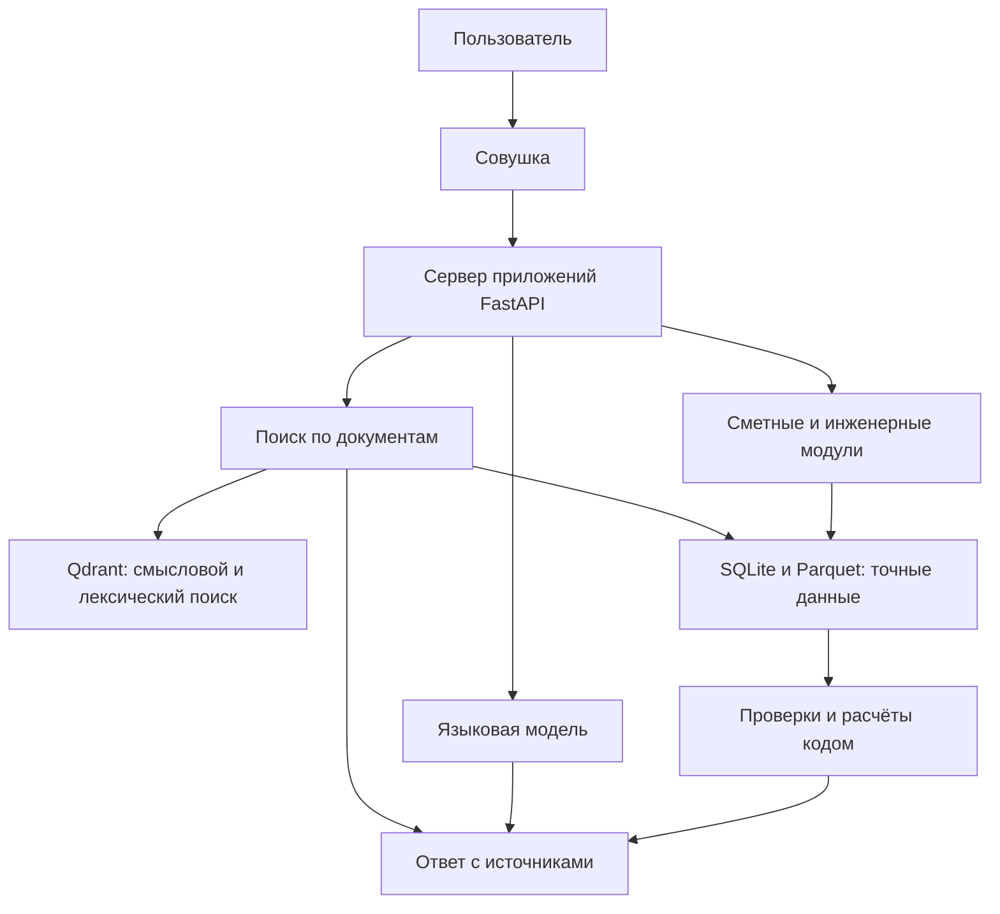

# Л.Е.С. — локальная инженерная система для строительных проектов


Л.Е.С. помогает работать с проектной документацией, сметами, спецификациями,
таблицами, нормативами и перепиской в одном локальном приложении.

Система принимает документы проекта, извлекает из них текст и таблицы, строит
поиск по содержанию, находит точные источники и передаёт их языковой модели.
Все проверяемые числовые операции выполняет программный код.

Главный принцип:

> Модель понимает задачу, связывает сведения и объясняет результат.  
> Код читает точные строки, проверяет единицы, считает и сохраняет происхождение чисел.  
> Окончательное инженерное или сметное решение принимает человек.

Л.Е.С. не скрывает нехватку данных. Если часть результата нельзя подтвердить,
система сохраняет рассчитанные строки, оставляет незаполненные значения и
показывает, каких документов или решений не хватает.

## Основные возможности

### Работа с документами

- создание отдельных наборов данных для проектов и рабочих подборок;
- загрузка PDF, DOCX, XLSX, CSV и других распространённых форматов;
- поиск по смыслу и по точным обозначениям, шифрам, маркам и артикулам;
- просмотр найденных фрагментов с указанием файла, страницы, листа или строки;
- переход к оригиналу документа;
- чтение полных таблиц через структурированные средства, без ограничения
  несколькими фрагментами поиска;
- сохранение состава проекта: папок, томов, разделов, файлов и состояния обработки.

### Сметный модуль

- работа с нормами ГЭСН и связанными ресурсами;
- локальная нормативная база, собранная из данных ФГИС ЦС и ФСНБ;
- отдельный поиск по нормативным карточкам;
- чтение полного состава выбранной нормы из структурированной базы;
- расчёт труда, машин, материалов, накладных расходов и сметной прибыли;
- формирование проверяемого черновика локального сметного расчёта;
- сохранение первоначального выбора нормы и последующих редакций;
- выгрузка расчёта в XLSX;
- явное подтверждение пользователем перед формированием окончательного результата.

Код не выбирает норму вместо модели и не исправляет её решение незаметно.
Если модель меняет норму, ресурсы или коэффициенты, создаётся новая редакция,
а предыдущая остаётся в истории.

### Студия документов

Студия формирует новые документы на основании уже прочитанного проекта:

1. пользователь выбирает набор данных;
2. выбирает том, папку или группу документов;
3. указывает конкретные файлы-основания;
4. система извлекает реквизиты и предлагает заполнение полей;
5. пользователь проверяет данные и создаёт черновик.

Качество результата зависит от качества обработки исходного набора данных.
Название и адрес объекта могут быть извлечены непосредственно из проектного
листа, даже если отдельная карточка проекта ещё не заполнена.

### Почта

- подключение почтовых ящиков через отдельный раздел конфигуратора;
- сохранение писем и вложений в самостоятельный набор данных;
- поиск писем из общего рабочего чата;
- открытие оригинального письма;
- защита от повторного импорта;
- последовательное продолжение первоначальной загрузки;
- сбор писем из классического Outlook на Windows без повторного просмотра всей
  истории после завершения первоначального импорта.

Просмотр почты находится в рабочем интерфейсе. Настройки подключения и фонового
сбора отделены от просмотра писем.

### Нормоконтроль

- проверка проектной документации по выбранным требованиям;
- замечания со ссылками на подтверждающие фрагменты;
- разделение подтверждённых, спорных и незакрытых пунктов;
- выгрузка результатов в JSON, HTML и XLSX;
- сохранение решений специалиста.

### CAD/BIM

- чтение подготовленных данных IFC и DXF;
- построение графа объектов и связей;
- просмотр элементов модели;
- связь выбранных объектов с документами и найденными фрагментами.

Этот раздел развивается отдельно и не подменяет исходную систему
автоматизированного проектирования.

### Программные интерфейсы

Л.Е.С. предоставляет:

- HTTP-интерфейс на FastAPI;
- потоковую выдачу состояния длительных операций;
- программный интерфейс MCP для внешних агентов;
- отдельные средства точного чтения документов, таблиц, норм и цен;
- журнал источников и выполненных действий.

## Как устроена система


```mermaid
flowchart TB
    U["Пользователь"] --> UI["Совушка"]
    UI --> P["Сервер приложений FastAPI"]
    P --> R["Поиск по документам"]
    P --> S["Сметные и инженерные модули"]
    P --> M["Языковая модель"]
    R --> Q["Qdrant: смысловой и лексический поиск"]
    R --> D["SQLite и Parquet: точные данные"]
    S --> D
    D --> C["Проверки и расчёты кодом"]
    R --> A["Ответ с источниками"]
    M --> A
    C --> A
```

### Поиск по документам

Каждый пользовательский набор данных проходит одинаковую обработку:

1. документ разбирается на адресуемые части;
2. создаётся смысловое представление текста;
3. отдельно сохраняются точные слова, обозначения и коды;
4. оба списка результатов объединяются по взаимному рангу;
5. общий модуль повторного ранжирования уточняет порядок;
6. система восстанавливает заголовки, соседний текст и родительскую таблицу;
7. модель получает фрагменты вместе с координатами источников.

Сметные нормативы не смешиваются с пользовательскими документами. У сметного
модуля собственная проверяемая база и собственный поисковый контур.

### Хранение данных

Рабочие данные не входят в исходный код:

- документы и почта пользователя;
- базы SQLite;
- таблицы Parquet;
- векторы Qdrant;
- журналы работы;
- результаты расчётов;
- настройки с ключами и паролями.

На Windows изменяемые данные хранятся в `%LOCALAPPDATA%\LES`. Обновление
приложения не должно удалять или переносить пользовательский корпус.

## Структура репозитория

| Каталог | Назначение |
|---|---|
| `backend/` | разбор файлов, индексирование, поиск, работа с Qdrant и моделями |
| `proxy/` | сервер FastAPI, маршруты и прикладные службы |
| `proxy/smeta_core/` | основной рабочий процесс сметного модуля |
| `sovushka/` | страницы и компоненты пользовательского интерфейса |
| `desktop/tauri/` | настольная оболочка для macOS и Windows |
| `clients/outlook_mail_poller/` | сборщик писем классического Outlook |
| `config/` | открытые настройки, схемы, шаблоны и описания версий |
| `installers/` | сценарии установки для поддерживаемых платформ |
| `tools/` | сборка, обслуживание, проверка и выпуск |
| `tests/` | модульные, интеграционные и проверочные испытания |
| `docs/` | архитектура, алгоритмы, установка и описание модулей |
| `examples/` | безопасные примеры данных |

## Требования

- Python 3.12;
- `uv` для управления окружением Python;
- Qdrant для хранения поискового индекса;
- локальная или совместимая удалённая языковая модель;
- macOS на Apple Silicon либо Windows 10/11;
- для основной установки Windows: Ollama и Docker Desktop.

Точный перечень поддерживаемых версий находится в
[docs/SOFTWARE_VERSIONS.md](docs/SOFTWARE_VERSIONS.md).

## Быстрый запуск для разработки

```bash
git clone --recurse-submodules https://github.com/proovcme/les_rag_public.git
cd les_rag_public
uv sync --extra mac-mlx
cp env.example .env
make verify
uv run lesctl start
```

После запуска:

- «Совушка»: `http://127.0.0.1:8051/classic`;
- программный интерфейс: `http://127.0.0.1:8050`;
- Qdrant: `http://127.0.0.1:6333`.

Подробная установка описана в [INSTALL.md](INSTALL.md) и
[docs/INSTALL_RUNBOOK.md](docs/INSTALL_RUNBOOK.md).

## Проверка изменений

Быстрая обязательная проверка:

```bash
make verify
```

Полный набор испытаний:

```bash
make test
```

Проверка почтового модуля:

```bash
make test-mail-release
```

Проверка готовности исходного кода к публикации:

```bash
make public-check
```

Автоматические проверки собирают нативную настольную оболочку и запускают
основной набор испытаний на macOS и Windows.

## Что не публикуется

В репозиторий не входят:

- документы заказчиков;
- рабочая переписка;
- нормативные материалы, которые нельзя распространять;
- локальные базы, индексы и снимки Qdrant;
- ключи, пароли и файлы `.env`;
- журналы работающей установки;
- результаты, содержащие сведения проектов.

Перед публикацией исходный код проходит автоматическую проверку путей и
возможных секретов. Правила приведены в
[docs/PUBLICATION_CHECKLIST.md](docs/PUBLICATION_CHECKLIST.md).

## Документация

- [Обзор документации](docs/index.md)
- [Установка](INSTALL.md)
- [Карта модулей](docs/MODULE_INDEX.md)
- [Карта кода](docs/CODE_MAP.md)
- [Программный интерфейс](docs/API.md)
- [Поддерживаемые платформы](docs/PLATFORMS.md)
- [Правила безопасности](SECURITY.md)
- [История изменений](CHANGELOG.md)

## Лицензия

Условия использования приведены в [LICENSE](LICENSE). Репозиторий доступен для
изучения и совместной инженерной работы, но документы проектов, нормативные
корпуса и другие закрытые данные лицензией не предоставляются.
