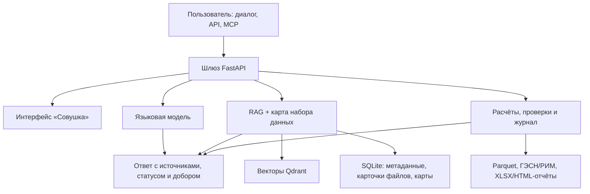
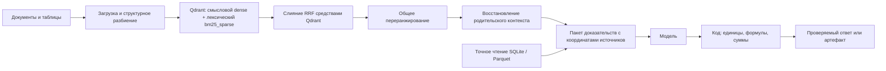

# Л.Е.С. — доказательная система для строительных проектов, смет и норм


Л.Е.С. превращает строительные документы в рабочую инженерную среду: проектные тома,
сметы, спецификации, таблицы, нормативы, переписку и CAD/BIM-данные можно спрашивать
человеческим языком, а система показывает не только ответ, но и откуда он взялся.

Это не «диалог с PDF». Обычный RAG умеет пересказать похожий фрагмент. Л.Е.С. строит
проверяемый путь:

```text
вопрос → выбранный проект или набор данных → нужные документы и строки
       → расчёт кодом, если есть числа
       → источники, препятствия и недостающие данные
       → ответ инженеру или сметчику
```

Главный принцип короткий: **модель связывает и объясняет, код считает, источники
доказывают**. Если данных не хватает, это должно быть видно, а не замазано красивой
фразой.

## Зачем это нужно

Строительный проект живёт не в одном аккуратном файле. Он размазан по ПЗ, РД, ВОР,
локальным сметам, спецификациям, сканам, письмам, нормативам, BIM-выгрузкам и таблицам.
В таком корпусе опасны две крайности:

- модель уверенно отвечает по одному похожему куску и теряет остальной проект;
- код пытается заменить сметчика/инженера жёсткими шаблонами и ломается на реальной задаче.

Л.Е.С. держит баланс. Модель остаётся профессиональным диспетчером задачи: понимает
контекст, выбирает ход, строит ВОР, объясняет результат. Код остаётся скучным, но
надёжным слоем: считает суммы, проценты, объёмы, НДС, НР/СП, ресурсные трассы,
проверяет единицы и хранит происхождение каждого числа. Скучный код — редкий случай,
когда это комплимент.

## Что внутри


```mermaid
flowchart TB
    U["Пользователь: диалог, API, MCP"] --> P["Шлюз FastAPI"]
    P --> S["Интерфейс «Совушка»"]
    P --> M["Языковая модель"]
    P --> R["RAG + карта набора данных"]
    P --> C["Расчёты, проверки и журнал"]
    R --> Q["Векторы Qdrant"]
    R --> DB["SQLite: метаданные, карточки файлов, карты"]
    C --> T["Parquet, ГЭСН/РИМ, XLSX/HTML-отчёты"]
    M --> A["Ответ с источниками, статусом и добором"]
    R --> A
    C --> A
```

Основные слои:

- **Совушка** — рабочий интерфейс для диалога, наборов данных, документов, инструментов и диагностики.
- **RAG и карта набора данных** — не только фрагменты, но и карточки файлов, типы документов,
  навигационная карта корпуса и строгий выбор области поиска.
- **Документы без ИИ** — отдельный просмотр наборов данных, файлов и фрагментов, чтобы можно
  было просто искать и читать, а не просить модель “ну найди же”.
- **Табличный слой** — структурированное извлечение, Parquet/SQL и расчёт по полной таблице, а не
  по нескольким верхним фрагментам поиска.
- **Сметный слой** — ВОР, спецификация → ВОР, ГЭСН/РИМ, ресурсы, НР/СП, цены, журнал расчёта,
  XLSX-файлы и честные статусы частичной, сценарной и окончательной оценки.
- **Нормоконтроль** — проверка проектной документации, замечания, отчёты JSON/HTML/XLSX.
- **CAD/BIM-контур** — граф объектов и отдельный просмотрщик на безопасных демонстрационных данных.
- **MCP/API** — машинный интерфейс для агентов и внешних инструментов.

## Архитектура RAG: RRF обязателен

Каждый текущий и будущий набор данных проходит один и тот же версионируемый договор. В рабочем
контуре нет отдельного «упрощённого RAG для этой папки» или скрытого только лексического режима:


```mermaid
flowchart LR
    D["Документы и таблицы"] --> I["Загрузка и структурное разбиение"]
    I --> Q["Qdrant: смысловой dense + лексический bm25_sparse"]
    Q --> F["Слияние RRF средствами Qdrant"]
    F --> X["Общее переранжирование"]
    X --> P["Восстановление родительского контекста"]
    P --> E["Пакет доказательств с координатами источников"]
    E --> L["Модель"]
    T["Точное чтение SQLite / Parquet"] --> E
    L --> C["Код: единицы, формулы, суммы"]
    C --> A["Проверяемый ответ или артефакт"]
```

- **Смысловой поиск (`dense`)** находит совпадения, даже когда пользователь и документ используют
  разные слова.
- **Лексический поиск (`bm25_sparse`)** удерживает точные коды, марки, обозначения и редкую терминологию.
- **RRF** объединяет независимые списки без притворной общей шкалы оценок.
- **Переранжирование** переставляет уже найденных кандидатов, но не выбирает за инженера норму,
  технологию или профессиональное решение.
- **Восстановление родительского контекста** возвращает заголовок, таблицу или соседний текст, чтобы
  модель не получила оторванную строку.
- **Структурированные средства чтения** читают точные строки и карточки из SQLite и Parquet. Они дополняют RAG,
  но не подменяют решение модели.

Коллекция хранит отпечаток модели векторизации, способа разбиения и схемы векторов. Несовместимый
смысловой канал не используется молча: набор данных получает честный статус деградации и должен быть
переиндексирован. Карты набора данных и память по образцу NotebookLM служат навигацией; фактом
становится только реальный фрагмент или точная строка с подтверждённым происхождением. Подробности:
[алгоритм RAG](docs/ALGO-rag-best-practices.md) и [карта кода](docs/CODE_MAP.md).

## Л.И.С.Т.: понять проект до разговора с моделью

**Л.И.С.Т.** — слой разбора и навигации по проектной документации только для чтения. Он показывает
набор данных как инженерный архив: папки, стадии, тома, разделы, файлы, шифры, страницы,
извлечённые таблицы и состояние индексации. Для обычного просмотра модель не нужна.

Л.И.С.Т. решает две разные задачи:

1. оператор видит, какие документы реально есть, что прочитано и где лежит источник;
2. модель получает компактную карту корпуса и адресно открывает нужный файл, раздел или
   таблицу вместо чтения всего проекта целиком.

Таблица получает устойчивый адрес из отпечатка файла, страницы, геометрии, заголовка и
версии алгоритма. Если PDF изменился, старый адрес помечается устаревшим и не выдаётся как
доказательство. Навигационная карта сама по себе ничего не доказывает.

В той же вкладке работает **Студия документов**: пользователь выбирает шаблон и объект,
видит источники и незаполненные поля, привязывает файлы-основания и создаёт отдельную
ревизию DOCX/XLSX. Каждый черновик получает manifest и SHA-256; исходные файлы проекта
не переписываются. Кнопка «Подготовить с Л.Е.С.» возвращает reviewable
`office_document_ir_v1`: предложения, confidence, пропуски и точные фрагменты-основания.
Файл остаётся заблокирован до применения предложений и ручного подтверждения; создание и
проверка офисного файла — детерминированная обязанность Л.И.С.Т.

## ФГИС ЦС и сметные данные

В интерфейсе **«Источники данных»** оператор запускает единое публичное обновление ФГИС ЦС.
ЛЕС получает доступный каталог, последние Сплит-формы по ценовым зонам и обновляет контур
ГЭСН. Код ресурса ищется по точному совпадению в локально сохранённых книгах; уровень цен, период,
регион и происхождение цены остаются в расчётной трассе.

```text
ГЭСН → нормативный расход ресурсов
     → цена ФГИС ЦС / индекс / подтверждённая КАЦ
     → ОТ + ЭМ + ОТм + материалы
     → НР + СП + НДС
     → формульная ЛСР и журнал проверки
```

ЛЕС скачивает только то, что источник отдаёт публично, и не обходит защиту капчей или закрытым токеном.
Отсутствующая цена не превращается в бесплатный ресурс: позиция остаётся незакрытой или
получает запрос КАЦ. В сметах действует та же граница ответственности: **модель выбирает и
обосновывает норму/аналог, код раскрывает ресурсы и считает; код не улучшает решение модели
задним числом**. Подробности: [ФГИС и цены](docs/ALGO-fgis-price.md) и
[механика смет](docs/SMETA_MECHANICS.md).

## Данные и обновления на Windows

Для рабочей сборки Windows обязательны Ollama, Docker Desktop и `uv`; Qdrant запускается в Docker,
интерфейс — в оболочке Tauri. При первом запуске ЛЕС проверяет эти компоненты, пытается установить
отсутствующие через winget (`uv` также имеет официальный резервный установщик), а при невозможности
показывает точную причину и официальный адрес загрузки. Интерфейс не выдаёт отсутствие Docker/Qdrant
за рабочий RAG.
Код приложения заменяемый, а `.env`, метабаза, документы, индексы, логи и результаты живут в
`%LOCALAPPDATA%\LES`; Qdrant использует именованный том. Поэтому установка новой версии не должна
создавать пустой RAG рядом со старым или терять пользовательский корпус.

Проверка новой версии не выполняется в фоне. В настройках есть две отдельные команды:
«Проверить обновление» только читает сведения об опубликованной версии, а «Обновить» по явному
решению оператора скачивает установщик, сверяет SHA-256 и открывает его.

Проверенные версии Qdrant, Ollama, моделей, Python, uv и сборочных средств перечислены в
[паспорте программного контура](docs/SOFTWARE_VERSIONS.md). Плавающий образ Qdrant не используется.

## Как работает ответ

Л.Е.С. старается отвечать не “магически”, а прослеживаемо:

1. Определяет задачу: поиск, проектная сводка, таблица, смета, нормоконтроль, CAD/BIM.
2. Выбирает область: весь RAG, проект, набор данных, конкретный файл или вложение.
3. Собирает доказательства: фрагменты, строки таблиц, карточки документов, нормативные источники.
4. Считает кодом всё, что должно быть числом: суммы, проценты, единицы, объёмы, ресурсы.
5. Отдаёт ответ с источниками, допущениями, препятствиями и следующим шагом.

Модель не обязана молчать, если не хватает финальной цены. Она должна дать ближайший
полезный результат: ВОР, развилку объёмов, частичную ЛСР, сценарную оценку, список
добора до окончательного результата. Но число без источника, журнала расчёта или явного сценарного допущения не
считается фактом.

## Что умеет ЛЕС

- **Проектная сводка:** что за объект, какие тома и документы видны, где пробелы.
- **Поиск по набору данных и документам:** адресный поиск, строгий файл, источники.
- **Проводник документов:** набор данных → документ → фрагменты, без вызова модели.
- **Студия документов:** агентные предложения с evidence, ручная проверка и append-only DOCX/XLSX-ревизии.
- **Табличные вопросы:** суммы и выборки по полным выгрузкам.
- **Спецификация → ВОР:** поставка отдельно, работы отдельно, происхождение количества.
- **Сметы:** ГЭСН/РИМ-навигация, журналы ресурсов, XLSX/CSV и табличные результаты,
  частичные и сценарные оценки с пометкой статуса.
- **Нормоконтроль:** замечания, доказательная база, отчёты.
- **CAD/BIM-демонстрация:** граф и просмотрщик на публично безопасных данных.

Подробные внешние страницы:

- [Обзор продукта](docs/public/overview.md)
- [Примеры работы](docs/public/demo-workflows.md)
- [Сметный модуль: что нужно для уверенного расчёта](docs/public/smeta-expert-review.md)
- [Границы приватности и данных](docs/public/privacy-and-data-boundaries.md)
- [Страница документации](docs/index.md)

## Быстрый запуск для разработки

```bash
uv sync --extra mac-mlx
cp env.example .env
make verify
uv run lesctl start
```

Локальные поверхности:

- Интерфейс «Совушка»: `http://127.0.0.1:8051/classic`
- API: `http://127.0.0.1:8050`
- Qdrant: `http://127.0.0.1:6333`

Для разработки агентам лучше начинать с:

- [AGENTS.md](AGENTS.md)
- [SKILL.md](SKILL.md)
- [docs/MODULE_INDEX.md](docs/MODULE_INDEX.md)
- [docs/CODE_MAP.md](docs/CODE_MAP.md)
- [История версий](docs/releases.md)

## Что не входит в публичный репозиторий

Репозиторий открыт для просмотра исходного кода и документации. Это не выгрузка
боевого RAG и не архив частных объектов.

Не публикуются:

- клиентские PDF/DOCX/XLSX/CAD/BIM/почта;
- снимки Qdrant, рабочая база SQLite, индексы и кеши;
- приватные нормативные корпуса без права публикации;
- `.env`, ключи, пароли, административные токены и закрытая схема рабочей среды;
- рабочие журналы и хранилище.

Перед публичной публикацией:

```bash
make public-check
git status --short
```

И ручной чеклист: [docs/PUBLICATION_CHECKLIST.md](docs/PUBLICATION_CHECKLIST.md).

## Рабочий контур

Л.Е.С. объединяет локальную среду исполнения, версионируемый смысловой и лексический поиск
с RRF, наборы данных, Л.И.С.Т., табличную
арифметику, журналы сметных расчётов, ФГИС-контур, нормоконтрольные отчёты, MCP/API и
сборки для Mac/Windows.

Если исходных данных недостаточно, Л.Е.С. возвращает рассчитанную часть, перечисляет
незакрытые позиции и указывает, какие источники нужны для завершения результата. Финальное
инженерное, нормативное и сметное решение остаётся за человеком.

Условия использования: [LICENSE](LICENSE). Правила безопасности: [SECURITY.md](SECURITY.md).
