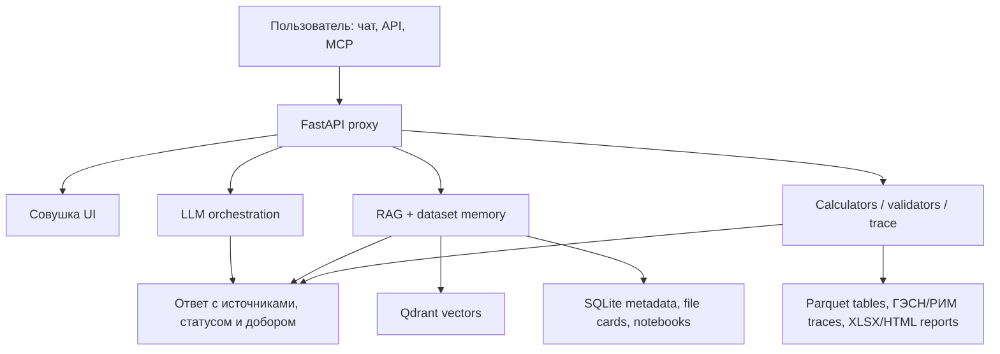

# Л.Е.С. — строительный evidence-harness для проектов, смет и норм


Л.Е.С. превращает строительные документы в рабочую инженерную среду: проектные тома,
сметы, спецификации, таблицы, нормативы, переписку и CAD/BIM-данные можно спрашивать
человеческим языком, а система показывает не только ответ, но и откуда он взялся.

Это не “чат с PDF”. Обычный RAG умеет пересказать похожий фрагмент. Л.Е.С. строит
проверяемый путь:

```text
вопрос → выбранный проект/датасет → нужные документы и строки
       → расчёт кодом, если есть числа
       → источники, blockers, missing inputs
       → ответ инженеру или сметчику
```

Главный принцип короткий: **модель связывает и объясняет, код считает, источники
доказывают**. Если данных не хватает, это должно быть видно, а не замазано красивой
фразой.

[Л.И.С.Т. — проект как БД](https://github.com/proovcme/les-list) ·
[Демо АТЛАС](https://les.ovc.me/vv/) · [Установка](INSTALL.md) ·
[Публичные сценарии](docs/public/demo-workflows.md)

## Зачем это нужно

Строительный проект живёт не в одном аккуратном файле. Он размазан по ПЗ, РД, ВОР,
локальным сметам, спецификациям, сканам, письмам, нормативам, BIM-выгрузкам и таблицам.
В таком корпусе опасны две крайности:

- модель уверенно отвечает по одному похожему куску и теряет остальной проект;
- код пытается заменить сметчика/инженера жёсткими шаблонами и ломается на реальной задаче.

Л.Е.С. держит баланс. Модель остаётся профессиональным диспетчером задачи: понимает
контекст, выбирает ход, строит ВОР, объясняет результат. Код остаётся скучным, но
надёжным слоем: считает суммы, проценты, объёмы, НДС, НР/СП, ресурсные трассы,
проверяет единицы и хранит provenance. Скучный код — редкий случай, когда это комплимент.

## Что внутри


```mermaid
flowchart TB
    U["Пользователь: чат, API, MCP"] --> P["FastAPI proxy"]
    P --> S["Совушка UI"]
    P --> M["LLM orchestration"]
    P --> R["RAG + dataset memory"]
    P --> C["Calculators / validators / trace"]
    R --> Q["Qdrant vectors"]
    R --> DB["SQLite metadata, file cards, notebooks"]
    C --> T["Parquet tables, ГЭСН/РИМ traces, XLSX/HTML reports"]
    M --> A["Ответ с источниками, статусом и добором"]
    R --> A
    C --> A
```

Основные слои:

- **Совушка** — рабочий UI для чата, датасетов, документов, инструментов и диагностики.
- **RAG и память датасета** — не только чанки, но и карточки файлов, типы документов,
  навигационная карта корпуса и строгий выбор области поиска.
- **Документы без ИИ** — отдельный просмотр датасетов, файлов и фрагментов, чтобы можно
  было просто искать и читать, а не просить модель “ну найди же”.
- **Л.И.С.Т.** — модуль файлового понимания Л.Е.С.: документация → проект → стадия →
  том → раздел → документ → лист → адресная таблица.
- **Табличный слой** — structured extract, Parquet/SQL и расчёт по полной таблице, а не
  по top-k кускам.
- **Сметный слой** — ВОР, спецификация → ВОР, ГЭСН/РИМ, ресурсы, НР/СП, цены, trace,
  XLSX-артефакты и честные статусы частичной/сценарной/финальной оценки.
- **Нормоконтроль** — проверка проектной документации, remarks, отчёты JSON/HTML/XLSX.
- **CAD/BIM контур** — граф объектов и публичный standalone viewer на безопасных demo data.
- **MCP/API** — машинный интерфейс для агентов и внешних инструментов.

## Как работает ответ

Л.Е.С. старается отвечать не “магически”, а прослеживаемо:

1. Определяет задачу: поиск, проектная сводка, таблица, смета, нормоконтроль, CAD/BIM.
2. Выбирает область: весь RAG, проект, датасет, конкретный файл или вложение.
3. Поднимает evidence: фрагменты, строки таблиц, карточки документов, нормативные источники.
4. Считает кодом всё, что должно быть числом: суммы, проценты, единицы, объёмы, ресурсы.
5. Отдаёт ответ с источниками, допущениями, blockers и следующим шагом.

Модель не обязана молчать, если не хватает финальной цены. Она должна дать ближайший
полезный результат: ВОР, развилку объёмов, частичную ЛСР, сценарную оценку, список
добора до final. Но число без источника, trace или явного сценарного допущения не
считается фактом.

## Л.И.С.Т.: проект как база данных

Л.И.С.Т. — часть Л.Е.С., которая не даёт проектному комплекту рассыпаться на
случайные файлы и chunks. Она строит read-only метамодель:

```text
Документация → Проект → Стадия → Том → Раздел → Документ → Лист → Таблица
```

Договоры, КП, сметы и переписка остаются связанными сущностями. Каталог таблиц
служит навигацией, а доказательством становится адресное повторное чтение
конкретной таблицы из оригинального PDF. Исходные файлы не склеиваются.

Публичное ядро подключено как Git submodule:
[`modules/les-list`](modules/les-list). Отдельный репозиторий даёт прозрачный
алгоритм, standalone CLI, wheel и собственный CI; продуктовый runtime, UI, RAG
и model tools остаются в Л.Е.С.

## Что уже можно показывать

- **Проектная сводка:** что за объект, какие тома и документы видны, где пробелы.
- **Поиск по датасету и документам:** targeted retrieval, строгий файл, источники.
- **Документный explorer:** датасет → документ → фрагменты, без вызова модели.
- **Табличные вопросы:** суммы и выборки по полным выгрузкам.
- **Спецификация → ВОР:** поставка отдельно, работы отдельно, trace количества.
- **Сметы:** ГЭСН/РИМ-навигация, ресурсные traces, XLSX/CSV/табличные артефакты,
  частичные и сценарные оценки с пометкой статуса.
- **Нормоконтроль:** remarks, доказательная база, отчёты.
- **CAD/BIM demo:** граф и viewer на публично безопасных данных.

Подробные внешние страницы:

- [Обзор продукта](docs/public/overview.md)
- [Демо-сценарии](docs/public/demo-workflows.md)
- [Сметный модуль: что нужно для уверенного расчёта](docs/public/smeta-expert-review.md)
- [Границы приватности и данных](docs/public/privacy-and-data-boundaries.md)
- [GitHub Pages entry](docs/index.md)

## Быстрый запуск для разработки

```bash
git clone --recurse-submodules https://github.com/proovcme/les_rag_public.git
cd les_rag_public
uv sync --extra mac-mlx
cp env.example .env
make verify
uv run lesctl start
```

Для уже существующего клона:

```bash
git submodule update --init --recursive
```

Локальные поверхности:

- Совушка UI: `http://127.0.0.1:8051/classic`
- API: `http://127.0.0.1:8050`
- Qdrant: `http://127.0.0.1:6333`

Для разработки агентам лучше начинать с:

- [AGENTS.md](AGENTS.md)
- [SKILL.md](SKILL.md)
- [docs/MODULE_INDEX.md](docs/MODULE_INDEX.md)
- [docs/CODE_MAP.md](docs/CODE_MAP.md)
- [docs/RELEASE_LEDGER.md](docs/RELEASE_LEDGER.md)

## Что не входит в публичный репозиторий

Репозиторий открыт как source-available code/documentation surface. Это не дамп
боевого RAG и не архив частных объектов.

Не публикуются:

- клиентские PDF/DOCX/XLSX/CAD/BIM/почта;
- Qdrant snapshots, SQLite runtime DB, индексы, caches;
- приватные нормативные корпуса без права публикации;
- `.env`, ключи, пароли, admin tokens, private runtime topology;
- рабочие логи и storage.

Перед публичной публикацией:

```bash
make public-check
git status --short
```

И ручной чеклист: [docs/PUBLICATION_CHECKLIST.md](docs/PUBLICATION_CHECKLIST.md).

## Текущий статус

Л.Е.С. — полевая инженерная система на пути к v1. Уже стабильно работают локальный
runtime, RAG-диспетчер, датасеты, документный просмотр, табличная арифметика,
сметные traces, нормоконтрольные отчёты, MCP/API и Mac/Windows сборки.

Некоторые доменные сценарии намеренно остаются частичными, пока не хватает evidence:
это не баг честности, это её цена. Финальное инженерное, нормативное и сметное решение
остаётся за человеком.

License: source-available, см. [LICENSE](LICENSE). Security policy: [SECURITY.md](SECURITY.md).
