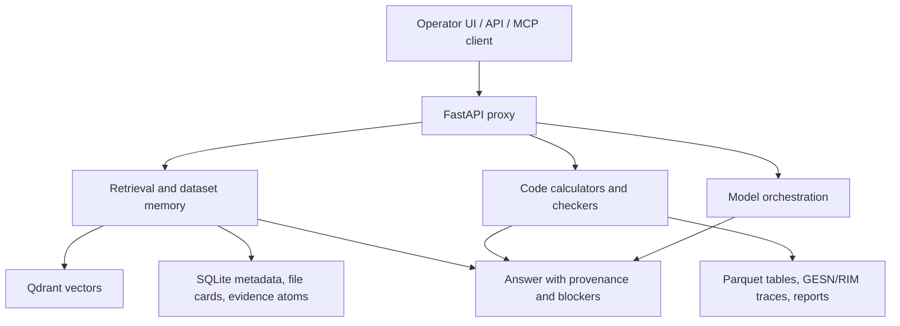

# Л.Е.С. — evidence-harness for construction data


Л.Е.С. превращает папку строительного проекта в локальный центр доказательных ответов:
модель связывает вопрос, документы и профессиональный язык, а код считает таблицы, сметы,
сверки и отчёты. Это не “чат с PDF”, а harness: источник → workflow → расчёт → blockers →
provenance → человеческий ответ.

Код открыт как source-available. Приватные датасеты, нормативные корпуса, индексы, почта,
проектные документы и runtime-секреты в репозиторий не входят.

## Why It Exists

В строительстве данные живут в разных мирах: ПЗ и тома РД, спецификации, ведомости,
сметы, почта, сканы, CAD/BIM, нормативы. Обычный RAG хорошо пересказывает найденный
фрагмент, но плохо отвечает на инженерный вопрос, где нужно одновременно:

- найти правильный документ, раздел и строку;
- не потерять одинокое число в таблице или примечании;
- посчитать полный объём, а не top-k куски;
- показать, чего не хватает для защищаемого вывода;
- не выдать красивую догадку как проверенный результат.

Л.Е.С. держит простое правило: **модель связывает и решает ход, код считает там, где нужен проверяемый расчёт, evidence всё объясняет**.

```text
Question
  -> scope and dataset memory
  -> retrieval / table / estimate / normcontrol workflow
  -> source rows, chunks, graph facts or calculation trace
  -> blockers and missing inputs
  -> model answer with provenance
```

## What It Can Show

### Dataset-as-notebook RAG

После индексации датасет получает навигационную память: типы файлов, роли документов,
карточки файлов, где искать паспорт объекта, состав проекта, ТЭП, инженерные разделы,
сметы и спецификации. Память помогает модели выбрать ход, но не заменяет evidence:
факты подтягиваются из конкретных файлов и строк.

### Tables and quantities

Табличные вопросы считаются по полной структурированной выгрузке, а не по нескольким
похожим чанкам. Поэтому “суммарный метраж кабеля” или “количество по ведомости” идёт
через Parquet/SQL-код, с понятной трассой и без арифметики языковой модели.

### Smeta / GESN / RIM workflow

Сметный режим direct model-first: в явном режиме «Смета» сначала отвечает сметчик-модель
по полному вопросу, вложениям и skill. Кодовый harness подключается как fallback и как
калькулятор/проверка норм, единиц, условий применимости, цен, НР/СП и provenance там,
где модель уже показала, что именно нужно считать. Если данных не хватает, ответ
показывает ведомость, допущения и ценовые пробелы, а не стену внутренних отказов.

Экспертная проверка сметного режима: [docs/public/smeta-expert-review.md](docs/public/smeta-expert-review.md).

### Normcontrol and reports

СПДС/normcontrol combines deterministic checks, retrieval and model synthesis. The system
can prepare JSON/HTML/XLSX reports with normalized remarks and human decision status,
while final engineering responsibility stays with the reviewer.

### CAD/BIM graph demo

The repository includes a public-safe standalone CAD/BIM viewer demo with synthetic data.
Real customer models are intentionally not shipped.

## Public Showcase

- Product overview: [docs/public/overview.md](docs/public/overview.md)
- Demo workflows: [docs/public/demo-workflows.md](docs/public/demo-workflows.md)
- Privacy and data boundaries: [docs/public/privacy-and-data-boundaries.md](docs/public/privacy-and-data-boundaries.md)
- Publication checklist: [docs/PUBLICATION_CHECKLIST.md](docs/PUBLICATION_CHECKLIST.md)
- GitHub Pages entry: [docs/index.md](docs/index.md)

## Architecture


```mermaid
flowchart TB
    U["Operator UI / API / MCP client"] --> P["FastAPI proxy"]
    P --> M["Model orchestration"]
    P --> R["Retrieval and dataset memory"]
    P --> C["Code calculators and checkers"]
    R --> Q["Qdrant vectors"]
    R --> S["SQLite metadata, file cards, evidence atoms"]
    C --> T["Parquet tables, GESN/RIM traces, reports"]
    M --> A["Answer with provenance and blockers"]
    C --> A
    R --> A
```

The important boundary is intentional:

- the model reads, decomposes, asks, explains and chooses the estimating path;
- code stores graph/facts/versions/provenance and computes/checks numbers when the path needs it;
- UI shows what was used: memory, files, tables, calculations, graph;
- missing data is a first-class result, not an exception to hide.

## Run Locally

```bash
uv sync --extra mac-mlx
cp env.example .env
make verify
uv run lesctl start
```

Primary local surfaces:

- Sovushka UI: `http://127.0.0.1:8051/classic`
- API: `http://127.0.0.1:8050`
- Qdrant: `http://127.0.0.1:6333`

For development and agent work, start with [AGENTS.md](AGENTS.md), [SKILL.md](SKILL.md),
[docs/MODULE_INDEX.md](docs/MODULE_INDEX.md), and [docs/CODE_MAP.md](docs/CODE_MAP.md).

## Repository Boundaries

This repository is a public-facing code and documentation surface, not a data dump.

Not included:

- customer PDFs, DOCX, XLSX, CAD/BIM and mail archives;
- Qdrant snapshots, SQLite runtime databases, generated indexes and caches;
- full normative corpora unless publishing rights are explicit;
- secrets, admin keys, private network topology and runtime credentials.

Before changing visibility or publishing a snapshot, run:

```bash
make public-check
git status --short
```

Then complete the manual audit in [docs/PUBLICATION_CHECKLIST.md](docs/PUBLICATION_CHECKLIST.md).

## Status

LES is a field research system moving toward v1. Stable pieces include table arithmetic,
GESN/RIM calculation traces, dataset memory, strict file-target retrieval, normcontrol reports,
MCP tooling and local-first runtime. Some workflows are intentionally marked partial until they
collect enough evidence to be defended.

License: source-available, see [LICENSE](LICENSE). Security policy: [SECURITY.md](SECURITY.md).
