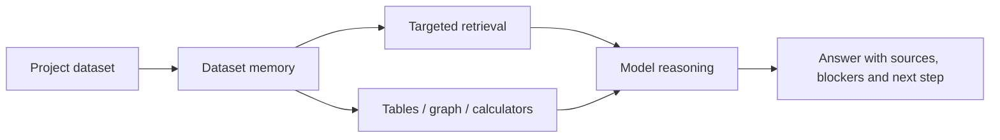

# Л.Е.С. public showcase

Л.Е.С. — local-first evidence-harness для строительных данных. Он помогает модели работать
как инженерный диспетчер: читать проект, выбирать workflow, находить источники, запускать
расчёты кодом и честно показывать blockers.

## Быстрый вход

- [Overview](public/overview.md) — что это за продукт и почему это не просто RAG.
- [Demo workflows](public/demo-workflows.md) — что показывать внешнему человеку.
- [Что нужно сметному модулю, чтобы считать](public/smeta-expert-review.md) — границы показа сметчику без шаблонов.
- [Privacy and data boundaries](public/privacy-and-data-boundaries.md) — что остаётся локально.
- [Publication checklist](PUBLICATION_CHECKLIST.md) — что проверить перед public visibility.

## One Screen Story

Главная философия: модель первична в рассуждении, но числа и проверяемые факты живут в коде,
графе, таблицах и provenance.
