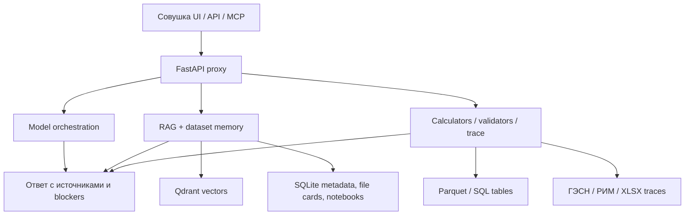

# Документация Л.Е.С.

Л.Е.С. — локальная инженерная среда для строительных данных: проектные документы,
сметы, спецификации, таблицы, нормативы, переписка и CAD/BIM-выгрузки собираются в
evidence-harness, где модель помогает понять задачу, а код считает проверяемые части.

Это не витрина “чат с PDF”. Л.Е.С. показывает путь ответа:

```text
проект / датасет / файл
  -> найденные источники и строки
  -> расчёт или проверка кодом
  -> статус результата и missing inputs
  -> человеческий ответ
```

Главная граница: **модель связывает и объясняет, код считает, источники доказывают**.

## Основные сценарии

- как выбирается проект, датасет или конкретный файл;
- как открывается no-AI просмотр документов: датасет -> документ -> фрагменты;
- как табличный вопрос считается по полной выгрузке, а не по похожему чанку;
- как спецификация превращается в ВОР-кандидат;
- как сметный режим показывает ВОР, нормы/ресурсы, trace, gaps и статус оценки;
- как нормоконтроль собирает замечания и evidence в отчёт;
- как CAD/BIM demo показывает граф объектов на безопасных публичных данных.

## Быстрый маршрут

- [README](https://github.com/proovcme/les_rag_public/blob/main/README.md) — главный рассказ о продукте.
- [INSTALL](https://github.com/proovcme/les_rag_public/blob/main/INSTALL.md) — запуск локального runtime.
- [SECURITY](https://github.com/proovcme/les_rag_public/blob/main/SECURITY.md) — границы публикации и обращения с данными.
- [Demo graph](https://github.com/proovcme/les_rag_public/blob/main/examples/minimal.cad_bim_graph.json) — безопасный пример CAD/BIM-графа.

## Из чего состоит



Ключевые слои:

- **Dataset memory** — карта корпуса: какие файлы есть, какие роли у документов, где искать факты.
- **Targeted retrieval** — поиск по выбранной области, проекту, датасету или файлу.
- **Document explorer** — простой просмотр документов и фрагментов без вызова модели.
- **Table layer** — структурированные таблицы, Parquet/SQL, проверяемые суммы и выборки.
- **Smeta layer** — ВОР, ГЭСН/РИМ, ресурсы, НР/СП, цены, trace и выгрузки.
- **Normcontrol** — замечания, evidence, статусы решений, JSON/HTML/XLSX отчёты.
- **CAD/BIM graph** — объектный граф и viewer для публично безопасных demo data.

## Честные границы

Л.Е.С. не обещает автоматического инженера, проектировщика или сметчика. Он даёт модели
память, источники и инструменты, а код считает там, где нужна проверяемая арифметика.
Финальное инженерное и сметное решение остаётся за человеком.

В public repo нет клиентских проектов, индексов, Qdrant snapshots, runtime databases,
почты, приватных нормативных корпусов и секретов. Это код и документация, а не выгрузка
боевого RAG.

## Запуск

```bash
uv sync --extra mac-mlx
cp env.example .env
make verify
uv run lesctl start
```

Локальные точки входа:

- Совушка UI: `http://127.0.0.1:8051/classic`
- API: `http://127.0.0.1:8050`
- Qdrant: `http://127.0.0.1:6333`

Главная страница репозитория: [README](https://github.com/proovcme/les_rag_public).
