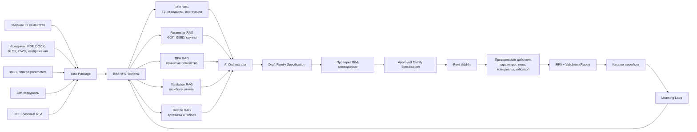
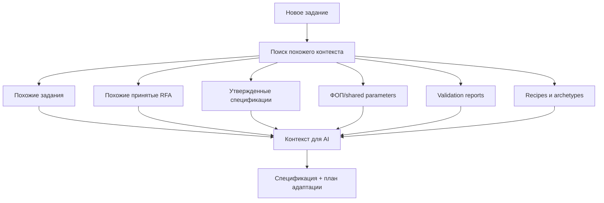
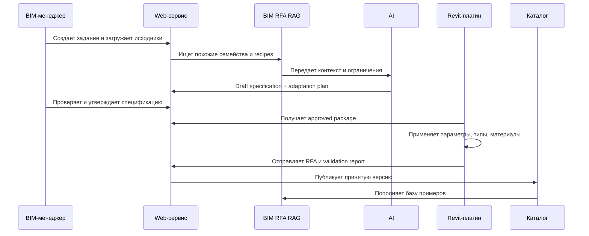
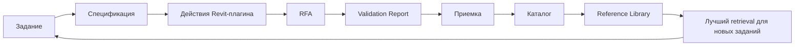

# BIM RFA RAG

## Коротко

АРТЕЛЬ — это не обычный RAG по текстовым документам.

Это **BIM RFA RAG**: поиск и использование контекста из заданий, стандартов, ФОП/shared parameters, принятых RFA-семейств, отчетов проверки и recipes для подготовки спецификации семейства и проверяемых действий Revit-плагина.

## Основная схема



## Что ищем



## Почему это не просто чат

Обычный чат дает текстовый ответ.

АРТЕЛЬ должен производить рабочие артефакты:

- `FamilySpecification`;
- список параметров;
- таблицу типов;
- сопоставление с ФОП;
- список конфликтов;
- `TransformationPlan`;
- validation checklist;
- action preview для Revit-плагина;
- итоговый validation report.

## Reference-Based Generation

Ключевой сценарий:



## Уровни автоматизации

| Уровень | Название | Что делает система |
| --- | --- | --- |
| L0 | Similarity Search | Находит похожие семейства и задания |
| L1 | Clone + Retype | Берет RFA-образец и меняет типы, параметры, материалы |
| L2 | Clone + Parametric Adaptation | Адаптирует формулы, диапазоны, обязательные параметры |
| L3 | Recipe Extraction | Извлекает recipe из принятых образцов |
| L4 | Generate from Recipe | Создает новое семейство по recipe через Revit API |

Для MVP целевой уровень: **L1-L2**.

## Learning Loop



Система улучшается только если хранится вся связка:

```text
задание -> спецификация -> действия -> RFA -> проверка -> приемка -> использование
```

## Практический вывод

Чем больше принято качественных семейств, тем лучше система:

- чаще находит подходящий образец;
- точнее предлагает параметры;
- быстрее собирает типоразмеры;
- заранее предупреждает о типовых ошибках;
- лучше выбирает recipe;
- уменьшает число ручных исправлений на приемке.

Но это работает только при дисциплине хранения контекста, проверок и решений приемки.
