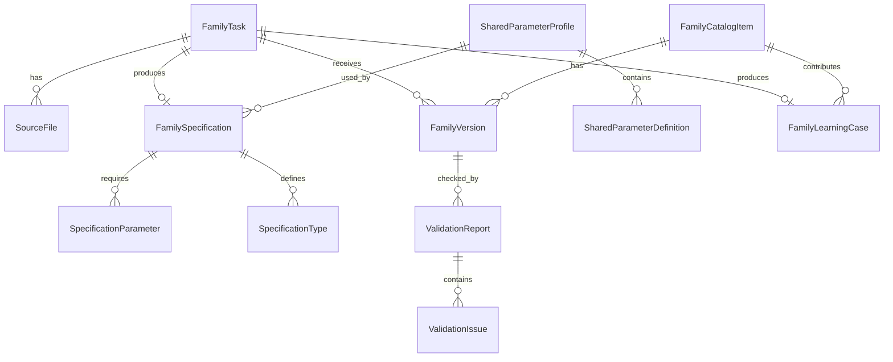

# Доменная модель

## Основные сущности

### FamilyTask

Задание на создание или обновление Revit-семейства.

Поля:

- `id`
- `number`
- `title`
- `description`
- `status`
- `priority`
- `category`
- `assigned_to`
- `created_by`
- `created_at`
- `updated_at`
- `due_date`

### SourceFile

Файл, прикрепленный к заданию, стандарту или версии семейства.

Поля:

- `id`
- `owner_type`
- `owner_id`
- `file_name`
- `file_type`
- `mime_type`
- `storage_key`
- `uploaded_by`
- `uploaded_at`

Типичные файлы:

- PDF с заданием;
- Excel-таблица типоразмеров;
- DWG-референс;
- изображение изделия;
- RFT-шаблон;
- RFA-пример;
- TXT-файл shared parameters.

### SharedParameterProfile

Профиль ФОП/shared parameters и его разобранные метаданные.

Поля:

- `id`
- `name`
- `version`
- `source_file_id`
- `parsed_at`
- `is_active`

### SharedParameterDefinition

Параметр, разобранный из файла shared parameters.

Поля:

- `id`
- `profile_id`
- `guid`
- `name`
- `parameter_type`
- `group_name`
- `discipline`
- `description`

### FamilySpecification

Формализованное целевое описание семейства, которое нужно разработать.

Поля:

- `id`
- `task_id`
- `family_name`
- `revit_category`
- `template_id`
- `shared_parameter_profile_id`
- `geometry_requirements`
- `material_requirements`
- `acceptance_checklist`
- `ai_summary`
- `created_at`
- `updated_at`

### SpecificationParameter

Параметр, требуемый спецификацией семейства.

Поля:

- `id`
- `specification_id`
- `name`
- `source`
- `shared_parameter_guid`
- `data_type`
- `group`
- `is_instance`
- `is_required`
- `default_value`
- `formula`
- `notes`

Источники параметра:

- `shared_parameter`
- `family_parameter`
- `built_in`

### SpecificationType

Ожидаемый тип семейства.

Поля:

- `id`
- `specification_id`
- `name`
- `values`
- `notes`

`values` хранит пары параметр-значение для конкретного типа.

### FamilyVersion

Отправленная версия файла семейства.

Поля:

- `id`
- `catalog_item_id`
- `task_id`
- `version`
- `rfa_file_id`
- `submitted_by`
- `submitted_at`
- `status`
- `changelog`

### ValidationReport

Результат проверки RFA-файла по спецификации и стандартам.

Поля:

- `id`
- `task_id`
- `family_version_id`
- `status`
- `summary`
- `created_at`
- `created_by`

### ValidationIssue

Одна найденная проблема в отчете проверки.

Поля:

- `id`
- `report_id`
- `severity`
- `code`
- `title`
- `description`
- `revit_element_id`
- `suggested_fix`

### FamilyCatalogItem

Утвержденная карточка семейства во внутреннем каталоге.

Поля:

- `id`
- `name`
- `category`
- `description`
- `current_version_id`
- `status`
- `tags`
- `classification_code`
- `manufacturer`
- `created_at`
- `updated_at`

### FamilyLearningCase

Связка задания, спецификации, результата и приемки, используемая для улучшения следующих разработок.

Поля:

- `id`
- `task_id`
- `catalog_item_id`
- `accepted_version_id`
- `source_summary`
- `approved_specification_id`
- `validation_report_id`
- `human_corrections`
- `archetype`
- `recipe_id`
- `quality_score`
- `reuse_count`
- `created_at`

## Схема связей

