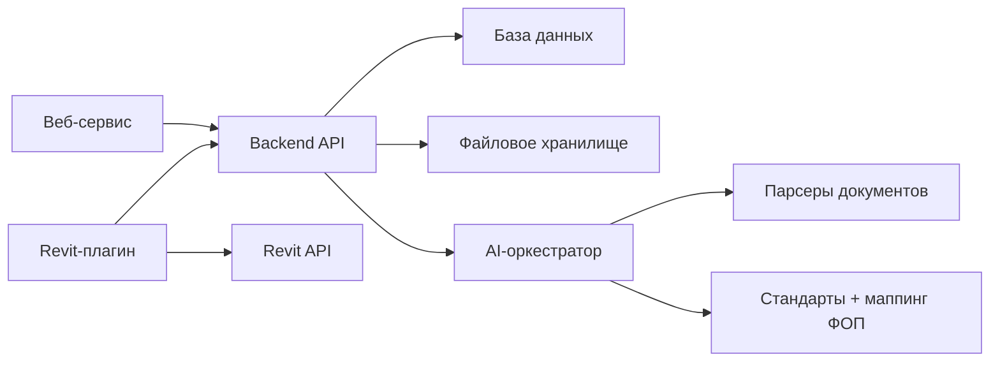
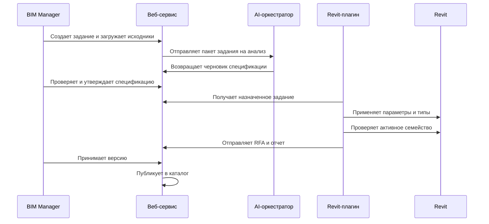

# Архитектура системы

## Компоненты верхнего уровня

## Веб-сервис

Веб-сервис — операционный центр продукта.

Зоны ответственности:

- создание и управление заданиями на разработку семейств;
- хранение исходников;
- управление стандартами и профилями ФОП/shared parameters;
- показ AI-разбора и спецификаций;
- управление проверкой и приемкой;
- публикация принятых версий в каталог;
- поиск и просмотр утвержденных семейств.

## Backend API

Зоны ответственности:

- аутентификация и авторизация;
- CRUD для заданий;
- загрузка и скачивание файлов;
- управление спецификациями;
- endpoints для Revit-плагина;
- хранение отчетов проверки;
- endpoints для поиска по каталогу;
- endpoints для AI-оркестрации.

## Revit-плагин

Зоны ответственности:

- авторизация через backend;
- список назначенных заданий;
- получение спецификации и ссылок на исходники;
- анализ активного family-документа;
- выполнение безопасных действий через Revit API;
- проверка данных семейства по спецификации;
- отправка RFA, метаданных, превью и отчетов.

## AI-оркестратор

Зоны ответственности:

- подготовка контекста из загруженных файлов и структурированных данных;
- извлечение требований в структурированную спецификацию;
- сопоставление требований с ФОП/shared parameters и стандартами;
- создание проверяемых планов вместо скрытых прямых действий;
- объяснение ошибок проверки и генерация метаданных каталога.

## Хранилище

Файловое хранилище используется для:

- загруженных исходников;
- шаблонов семейств;
- файлов ФОП/shared parameters;
- отправленных RFA-файлов;
- сгенерированных отчетов;
- изображений предпросмотра.

База данных должна хранить метаданные и связи, а не крупные бинарные файлы.

## Модель действий Revit-плагина

Действия должны быть явными и аудируемыми.

Первичные безопасные действия:

- добавить параметр семейства из профиля ФОП/shared parameters;
- создать или обновить тип семейства;
- установить значение параметра типа;
- проверить обязательные параметры;
- проверить наличие типов;
- проверить пустые обязательные значения;
- собрать метаданные семейства;
- отправить текущую RFA-версию.

Будущие типы действий:

- создать reference planes;
- создать размеры и constraints;
- назначить material parameters;
- разместить вложенное семейство;
- сгенерировать простую extrusion-геометрию.

## Интеграционный поток

